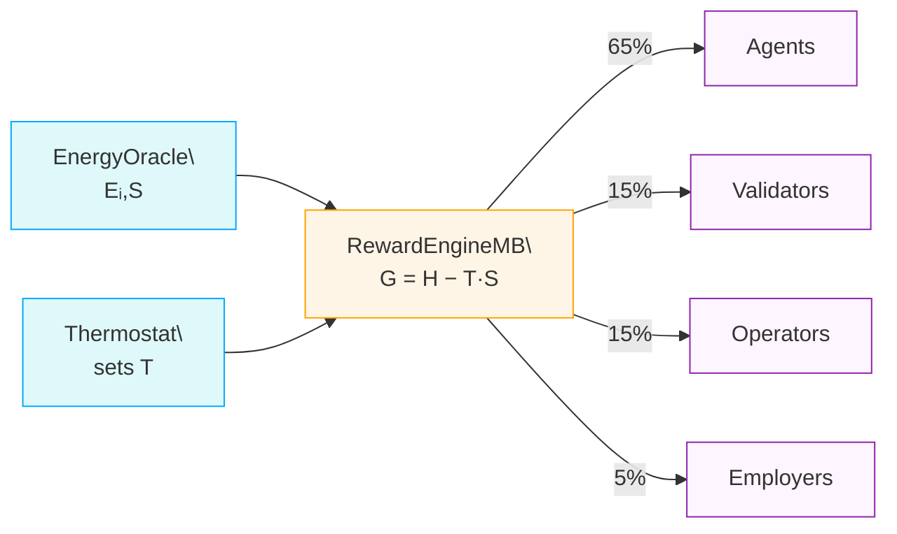

# AGIJob Manager

[](LICENSE) [](https://github.com/MontrealAI/AGIJobsv2/actions/workflows/ci.yml)

AGIJob Manager is an experimental suite of Ethereum smart contracts and tooling for coordinating trustless labour markets among autonomous agents. This repository hosts the maintained **v2** release directly under `contracts/`. Deprecated v0/v1 artifacts are archived in [MontrealAI/AGIJobsv0](https://github.com/MontrealAI/AGIJobsv0) and were never audited. For help migrating older deployments, see [docs/migration-guide.md](docs/migration-guide.md).

> **Legacy resources:** Historical AGIJobsv0 materials remain available in the archived [MontrealAI/AGIJobsv0](https://github.com/MontrealAI/AGIJobsv0) repository. This project carries forward maintained guides under `docs/`, while preserved v0 references now live in [`docs/legacy/`](docs/legacy/README.md).

> **ENS identity required:** Before participating, each agent or validator must control an ENS subdomain. Agents use `<name>.agent.agi.eth` (or `<name>.alpha.agent.agi.eth`) and validators use `<name>.club.agi.eth` (or `<name>.alpha.club.agi.eth`). Follow the [ENS identity setup guide](docs/ens-identity-setup.md) to register and configure your name.

All modules now assume the 18‑decimal `$AGIALPHA` token for payments, stakes and dispute deposits with the token address fixed at deployment. The canonical token is deployed externally; this repository ships [`contracts/test/AGIALPHAToken.sol`](contracts/test/AGIALPHAToken.sol) for local testing only. Token address and decimal configuration live in [`config/agialpha.json`](config/agialpha.json) and feed both Solidity and TypeScript consumers.

## Prerequisites

- Node.js 20.x LTS and npm 10+
- Run `nvm use` to select the version from `.nvmrc`.

## Table of Contents

- [Identity policy](#identity-policy)
- [AGIALPHA configuration](#agialpha-configuration)
- [Fee handling and treasury](#fee-handling-and-treasury)
- [Thermodynamic Incentives](#thermodynamic-incentives)
- [Deploy defaults](#deploy-defaults)
- [Mainnet Deployment](#mainnet-deployment)
- [Migrating from legacy](#migrating-from-legacy)
- [Quick Start](#quick-start)
- [Continuous Integration](#continuous-integration)
- [Deployed Addresses](#deployed-addresses)
- [Step‑by‑Step Deployment with $AGIALPHA](#step-by-step-deployment-with-agialpha)
- [Agent/Validator Identity – ENS subdomain registration](#agentvalidator-identity--ens-subdomain-registration)
- [Documentation](#documentation)

### Identity policy

Agents and validators must own ENS subdomains under `agent.agi.eth`/`alpha.agent.agi.eth` and `club.agi.eth`/`alpha.club.agi.eth`. The registry now boots with the canonical `alpha.*` aliases enabled so owners of delegated names are recognised without any additional configuration. All workflows perform on-chain verification and bypass mechanisms are reserved for emergency governance only. See [docs/ens-identity-policy.md](docs/ens-identity-policy.md) for details.

> **Emergency allowlists:** The `IdentityRegistry` owner can directly whitelist addresses using `addAdditionalAgent` or `addAdditionalValidator`. These overrides bypass ENS proofs and should only be used to recover from deployment errors or other emergencies.

### AGIALPHA configuration

Token parameters are defined once in [`config/agialpha.json`](config/agialpha.json). Run `npm run compile` after editing this file to regenerate `contracts/Constants.sol` with the canonical token address, symbol, name, decimals, scaling factor and burn address. Any change to `config/agialpha.json` must be followed by `npm run compile` or the constants check in CI will fail.

`npm run compile` validates the configured addresses, ERC‑20 metadata and decimals before writing the Solidity constants. The command halts if the token or burn addresses are malformed, zero (where disallowed), the symbol/name fields are empty or the decimals fall outside the supported `0-255` range, preventing a bad configuration from reaching production contracts.

Run `npm run verify:agialpha -- --rpc <https-url-or-ws-url>` after deployments to cross-check `config/agialpha.json` and `contracts/Constants.sol` against the live `$AGIALPHA` token metadata. The script aborts if the on-chain decimals, symbol or name differ from the committed configuration. Set `VERIFY_RPC_URL` (or `RPC_URL`) to avoid passing `--rpc` on every invocation; use `--timeout <ms>` to override the default 15 s RPC timeout.

### Fee handling and treasury

`JobRegistry` routes protocol fees to `FeePool`, which burns a configurable percentage (`burnPct`) when an employer finalizes a job and escrows the remainder for platform stakers. By default the `treasury` is unset (`address(0)`), so any rounding dust is burned. Governance may later call `StakeManager.setTreasury`, `JobRegistry.setTreasury`, or `FeePool.setTreasury` to direct funds to a community-controlled treasury. These setters reject the owner address and, for `FeePool`, require the target to be pre-approved via `setTreasuryAllowlist`. The platform only routes funds and never initiates or profits from burns.

### Thermodynamic Incentives

`RewardEngineMB` meters task energy against a global free‑energy budget. The `EnergyOracle` reports per‑task energy `Eᵢ` and entropy `S`, while the `Thermostat` sets the system temperature `T` that scales reward spread. Using the Gibbs relation `G = H − T·S`, the engine increases rewards for low‑energy work and adjusts role‑level chemical potentials (μᵣ) to maintain balance.

Higher `T` amplifies the entropy term, spreading rewards across more participants; lower `T` concentrates payouts on the most energy‑efficient contributors. Each epoch the free‑energy budget divides **65 %** to agents, **15 %** to validators, **15 %** to operators and **5 %** to employers. See [docs/reward-settlement-process.md](docs/reward-settlement-process.md) for a full walkthrough and [docs/thermodynamic-incentives.md](docs/thermodynamic-incentives.md) for derivations.

Governance can rebalance these weights or retune the PID controller by editing [`config/thermodynamics.json`](config/thermodynamics.json) (or per-network overrides) and running [`scripts/updateThermodynamics.ts`](scripts/updateThermodynamics.ts). The full workflow is described in [docs/thermodynamics-operations.md](docs/thermodynamics-operations.md).

**Role shares per epoch**

- Agents – 65 %
- Validators – 15 %
- Operators – 15 %
- Employers – 5 %



#### Best Practices

- **Agents** – Optimise code and workflows to minimise measured energy per task; consistent low energy boosts rewards and reputation.
- **Validators** – Use efficient validation routines and cache common checks to lower entropy in votes, increasing payout weight.
- **Employers** – Design jobs with clear requirements so agents expend minimal energy on speculation or rework, improving overall budget share.
- **Operators** – Maintain energy‑efficient, highly available infrastructure and publish transparent metrics so the oracle can measure consumption accurately.

### Deploy defaults

Spin up the full stack with a single helper script:

```bash
npx hardhat run scripts/deployDefaults.ts --network <network> --governance <address>
```

Provide `--governance` to assign a multisig or timelock owner. Include `--no-tax` to skip deploying `TaxPolicy`.

### System pause maintenance

`SystemPause.setModules` now validates that every module has already transferred ownership or governance to the pause contract before it rewires addresses. This prevents accidentally wiring in contracts that cannot be paused during an emergency. When swapping modules, transfer ownership to the deployed `SystemPause` address first, then run the helper script:

```bash
npx hardhat run scripts/updateSystemPause.ts --network <network>
```

The script performs a dry run by default, reporting any address, ownership or pauser mismatches. Re-run with `--execute` once all modules report `owner == SystemPause` to apply the wiring transaction safely.

### Mainnet Deployment

For a step-by-step mainnet deployment using Truffle, see the [Deploying AGIJobs v2 to Ethereum Mainnet (CLI Guide)](docs/deploying-agijobs-v2-truffle-cli.md).

- **New:** Non-technical operators can follow the streamlined [Non-Technical Production Deployment on Ethereum Mainnet](docs/deployment/non-technical-truffle-mainnet.md) playbook. It consolidates every command, checklist, and verification step (including the governance tuning helper) so a business owner can launch without writing code.

- [docs/deployment-production-guide.md](docs/deployment-production-guide.md) – step-by-step walkthrough for deploying AGI Jobs v2 using only a web browser and Etherscan.
- [docs/deployment-guide-production.md](docs/deployment-guide-production.md) – production deployment checklist.
- [docs/agi-jobs-v2-production-deployment-guide.md](docs/agi-jobs-v2-production-deployment-guide.md) – non‑technical guide highlighting best practices such as true token burning and owner updatability.
- [docs/burn-receipts.md](docs/burn-receipts.md) – employer-side token burn process and validator verification.
- [docs/expired-unclaimed-handling.md](docs/expired-unclaimed-handling.md) – guidance for expired stakes and unclaimed fees.
- [docs/release-checklist.md](docs/release-checklist.md) – steps to compile, test and prepare an Etherscan call plan.

## Migrating from legacy

The original v0 and v1 contracts remain available in the archived repository history (see the `legacy` tag in [MontrealAI/AGIJobsv0](https://github.com/MontrealAI/AGIJobsv0)) and receive no support. New development should target the v2 modules in `contracts`. See [docs/migration-guide.md](docs/migration-guide.md) for help mapping legacy entry points to their v2 equivalents.

## Quick Start

Use the `examples/ethers-quickstart.js` script to interact with the deployed contracts. Export `RPC_URL`, `PRIVATE_KEY`, `JOB_REGISTRY`, `STAKE_MANAGER`, `VALIDATION_MODULE` and `ATTESTATION_REGISTRY`.

The [API reference](docs/api-reference.md) describes every public contract function and includes TypeScript and Python snippets. For an event‑driven workflow check the minimal [agent gateway](examples/agent-gateway.js) that listens for `JobCreated` events and applies automatically.

### Governance control center

Run the orchestrator to synchronise every owner-controlled module with the committed configuration in one command:

```bash
npm run owner:plan -- --network <network>
```

The command performs a dry run by default, streaming the output of each module script listed in [`config/governance-control.json`](config/governance-control.json). To apply the updates, append `--execute` (or run `npm run owner:apply -- --network <network>`). Filter to a subset of modules using `--module FeePool --module StakeManager`, or skip a module with `--skip TaxPolicy`. The orchestrator validates the Hardhat installation, halts on the first error, and preserves the detailed audit trail already produced by the underlying scripts.

Need to change platform economics, treasury addresses, or tax policy text quickly? Populate `config/governance-update.json` (copy from [`config/governance-update.example.json`](config/governance-update.example.json)) and run:

```bash
npx hardhat run --network <network> scripts/governance/update-economics.ts --config config/governance-update.json
```

Append `--execute` to broadcast transactions once the dry-run summary looks correct. The helper prints current vs. desired values, method names, and transaction hashes for audit-ready change control.

### Network timeouts

Outbound HTTP requests from the gateway, example agents and validator UI respect the `FETCH_TIMEOUT_MS` environment variable (default `5000` milliseconds). Browser clients read the value from `NEXT_PUBLIC_FETCH_TIMEOUT_MS`.

### Post a job

```bash
node -e "require('./examples/ethers-quickstart').postJob()"
```

### Stake tokens

```bash
node -e "require('./examples/ethers-quickstart').stake('1')"
```

### Validate a submission

```bash
node -e "require('./examples/ethers-quickstart').validate(1, '0xhash', '0xlabel', [], true, '0xsalt')"
```

### Raise a dispute

```bash
node -e "require('./examples/ethers-quickstart').dispute(1, 'ipfs://evidence')"
```

## Continuous Integration

- **Run the local pipeline:** `npm run ci:local`
- **What it covers:**
  - Regenerates on-chain constants and fails if [`contracts/Constants.sol`](contracts/Constants.sol) is out of sync.
  - Verifies the canonical `$AGIALPHA` configuration via [`scripts/verify-agialpha.ts`](scripts/verify-agialpha.ts).
  - Executes module wiring checks with the same mainnet fork defaults used in CI.
  - Lints Solidity, JavaScript and TypeScript sources and runs the Hardhat unit test suite.
- **Why it matters:** the command mirrors the critical `build` job from [`.github/workflows/ci.yml`](.github/workflows/ci.yml). Husky installs a pre-commit hook that invokes `npm run ci:local`, ensuring every commit is validated with the full developer-facing CI gate before it reaches GitHub.

If you need to iterate quickly on a long-running task, use `SKIP_HUSKY=1 git commit ...` to bypass the hook temporarily, then re-run `npm run ci:local` manually before pushing.

## Deployed Addresses

| Module            | Address                                      |
| ----------------- | -------------------------------------------- |
| `$AGIALPHA` Token | `0xA61a3B3a130a9c20768EEBF97E21515A6046a1fA` |
| StakeManager      | `0x0000000000000000000000000000000000000000` |
| ReputationEngine  | `0x0000000000000000000000000000000000000000` |
| IdentityRegistry  | `0x0000000000000000000000000000000000000000` |
| ValidationModule  | `0x0000000000000000000000000000000000000000` |
| DisputeModule     | `0x0000000000000000000000000000000000000000` |
| CertificateNFT    | `0x0000000000000000000000000000000000000000` |
| JobRegistry       | `0x0000000000000000000000000000000000000000` |

## Step‑by‑Step Deployment with $AGIALPHA

Prefer scripted deployments when possible. The Hardhat helper at
[`scripts/deploy/providerAgnosticDeploy.ts`](scripts/deploy/providerAgnosticDeploy.ts)
automates contract deployment, wiring, token metadata verification and a
post-deploy integration test. See
[docs/deployment/provider-agnostic-deploy.md](docs/deployment/provider-agnostic-deploy.md)
for detailed instructions.

Record each address during deployment. The defaults below assume the 18‑decimal `$AGIALPHA` token; token rotation is considered legacy and is not supported in new deployments.

| Module                                                                     | Owner‑only setters                                                                                                                                             |
| -------------------------------------------------------------------------- | -------------------------------------------------------------------------------------------------------------------------------------------------------------- |
| [`AGIALPHAToken`](contracts/test/AGIALPHAToken.sol) _(local testing only)_ | `mint`, `burn`                                                                                                                                                 |
| [`StakeManager`](contracts/StakeManager.sol)                               | `setMinStake`, `setSlashingPercentages`, `setTreasury`, `setMaxStakePerAddress`                                                                                |
| [`JobRegistry`](contracts/JobRegistry.sol)                                 | `setModules`, `setFeePool`, `setTaxPolicy`, `setAgentRootNode`, `setAgentMerkleRoot`,<br>`setTreasury`, `setIdentityRegistry`                                  |
| [`ValidationModule`](contracts/ValidationModule.sol)                       | `setJobRegistry`, `setCommitWindow`, `setRevealWindow`, `setValidatorBounds`, `setApprovalThreshold`, `setIdentityRegistry`                                    |
| [`IdentityRegistry`](contracts/IdentityRegistry.sol)                       | `setENS`, `setNameWrapper`, `setReputationEngine`, `setAgentRootNode`, `setClubRootNode`, `setAgentMerkleRoot`, `setValidatorMerkleRoot`, `setAgentProfileURI` |
| [`DisputeModule`](contracts/modules/DisputeModule.sol)                     | `setDisputeFee`, `setTaxPolicy`, `setFeePool`                                                                                                                  |
| [`ReputationEngine`](contracts/ReputationEngine.sol)                       | `setCaller`, `setWeights`, `blacklist`, `unblacklist`                                                                                                          |
| [`CertificateNFT`](contracts/CertificateNFT.sol)                           | `setJobRegistry`, `setStakeManager`, `setBaseURI` _(one-time IPFS prefix)_                                                                                     |
| [`FeePool`](contracts/FeePool.sol)                                         | `setStakeManager`, `setRewardRole`, `setBurnPct`, `setTreasury`                                                                                                |

### Etherscan steps

1. **Deploy contracts** – open each verified contract → **Contract → Deploy** and provide the constructor parameters listed above.
2. **Wire modules** – from each contract’s **Write** tab call:
   - `JobRegistry.setModules(validationModule, stakeManager, reputationEngine, disputeModule, certificateNFT, feePool, new address[](0))`
     - any `_ackModules` passed to this call must implement `IJobRegistryAck` and successfully respond to `acknowledgeFor(address(0))`
   - Point modules back to the registry with `StakeManager.setJobRegistry(jobRegistry)`, `ValidationModule.setJobRegistry(jobRegistry)`, `DisputeModule.setJobRegistry(jobRegistry)` and `CertificateNFT.setJobRegistry(jobRegistry)`
   - Authorise cross‑module calls using `StakeManager.setDisputeModule(disputeModule)` and `CertificateNFT.setStakeManager(stakeManager)`
   - After wiring, call `CertificateNFT.setBaseURI('ipfs://<CID>/')` once to lock the metadata prefix so `tokenURI(tokenId)` resolves deterministically
   - `JobRegistry.setTaxPolicy(taxPolicy)` then `DisputeModule.setTaxPolicy(taxPolicy)`
   - `JobRegistry.setIdentityRegistry(identityRegistry)` and `ValidationModule.setIdentityRegistry(identityRegistry)`
   - Load ENS settings with `IdentityRegistry.setAgentRootNode`, `setClubRootNode`, `setAgentMerkleRoot` and `setValidatorMerkleRoot`
3. **Verify wiring** – run `npm run wire:verify -- --network <network>` to confirm
   on-chain module references, ENS settings and root hashes match
   `config/agialpha.<network>.json` and `config/ens.<network>.json`.
4. **Example transactions** – after wiring you can:
   - Approve and stake: `$AGIALPHA.approve(StakeManager, 1_000000000000000000)` then `StakeManager.depositStake(role, 1_000000000000000000)`
   - Post a job: `JobRegistry.createJob(1_000000000000000000, "ipfs://QmHash")`

### Transfer ownership to a multisig or timelock

After deployment hand control of each module to a governance contract so no
single key can change parameters:

1. Deploy a multisig wallet or an OpenZeppelin
   `TimelockController`.
2. From the deployer account hand over control of each module:

   - `StakeManager.setGovernance(multisig)`
   - `JobRegistry.setGovernance(multisig)`
   - `transferOwnership(multisig)` on all other modules such as
     `ValidationModule`, `ReputationEngine`, `IdentityRegistry`,
     `CertificateNFT`, `DisputeModule`, `FeePool`, `PlatformRegistry`,
     `JobRouter`, `PlatformIncentives`, `TaxPolicy` and `SystemPause`.
     To automate this step run:

   ```bash
   npx ts-node --compiler-options '{"module":"commonjs"}' scripts/transfer-ownership.ts --new-owner <address>
   ```

   The script reads `docs/deployment-addresses.json` and issues the
   appropriate `setGovernance` or `transferOwnership` calls for each
   deployed module.

3. To rotate governance later, the current multisig executes
   `setGovernance(newOwner)` or `transferOwnership(newOwner)` as
   appropriate and the new address assumes control after the relevant
   event. Timelock contracts must schedule and execute the call; direct EOA
   transactions will revert once ownership has moved.

For a day-2 operations checklist covering pauser rotation, emergency
halt procedures, and monitoring, consult
[`docs/security-deployment-guide.md`](docs/security-deployment-guide.md).

### Agent/Validator Identity – ENS subdomain registration

All participants must prove ownership of a subdomain in the AGI ENS
namespace before interacting with the system:

- **Agents** use `<name>.agent.agi.eth` (aliases under `alpha.agent.agi.eth` are also accepted).
- **Validators** use `<name>.club.agi.eth`.

To register:

1. Request a subdomain from the AGI operators or the registration dApp.
2. Set the resolver so the name points to your wallet address (or wrap the
   name with the ENS NameWrapper).
3. Confirm the transaction and keep the name assigned to the same address.

Transactions will revert if the address does not own the supplied
subdomain. Owner‑controlled allowlists
(`JobRegistry.setAgentMerkleRoot` and `ValidationModule.setValidatorMerkleRoot`)
exist only for emergencies and should not be relied on by normal users.
For a detailed walkthrough see
[docs/ens-identity-setup.md](docs/ens-identity-setup.md), including operator
steps for issuing subdomains.

Operators can synchronise the on-chain ENS configuration at any time with:

```bash
IDENTITY_REGISTRY=<registry>
ENS_REGISTRY=<ens>
NAME_WRAPPER=<wrapper>
AGENT_ROOT_NODE=agent.agi.eth \
CLUB_ROOT_NODE=club.agi.eth \
ENABLE_AGENT_ALIASES=alpha.agent.agi.eth \
ENABLE_CLUB_ALIASES=alpha.club.agi.eth \
npx hardhat run scripts/configureEns.ts --network <network>
```

`AGENT_ROOT_NODE`/`CLUB_ROOT_NODE` accept either raw node hashes or ENS
names; the script resolves them and automatically keeps the canonical
`alpha.agent.agi.eth`/`alpha.club.agi.eth` aliases enabled. Additional
aliases can be managed by setting comma-separated lists in
`ENABLE_*_ALIASES` and `DISABLE_*_ALIASES`.

### Delegate addresses with AttestationRegistry

`AttestationRegistry` lets ENS name owners pre-authorize other addresses for
agent or validator roles. Authorized addresses skip expensive on-chain ENS lookups
and can use the platform without holding the ENS name directly. Owners call
`attest(node, role, address)` to grant access and `revoke(node, role, address)` to
remove it. See [docs/attestation.md](docs/attestation.md) for a walkthrough and
CLI examples.

### Quickstart flow

1. **Obtain Merkle proof** – request your address proof from AGI operators or generate it from the published allowlist.
2. **Stake** – approve `$AGIALPHA` for the `StakeManager` and call `depositStake(role, amount)` (`role` 0 = agent, 1 = validator`).
3. **Apply** – submit `applyForJob(jobId, subdomain, proof)` on `JobRegistry` or use `stakeAndApply` to combine staking and applying.
4. **Commit & reveal** – validators call `commitValidation(jobId, hash, subdomain, proof)` then `revealValidation(jobId, approve, burnTxHash, salt, subdomain, proof)`.
5. **Resolve disputes** – anyone can raise a dispute via `acknowledgeAndDispute(jobId, evidence)`; the owner settles it on `DisputeModule.resolve`.

### Etherscan job lifecycle

1. **Create** – on `JobRegistry` **Write Contract**, call `createJob(reward, deadline, specHash, uri)` after approving the `StakeManager` for `reward + fee` (fee = `reward * feePct / 100`).
2. **Apply** – agents stake through `StakeManager.depositStake(0, amount)` then call `applyForJob(jobId, label, proof)`.
3. **Validate** – selected validators execute `commitValidation(jobId, hash, label, proof)` followed by `revealValidation(jobId, approve, burnTxHash, salt, label, proof)`.
4. **Finalize** – once the reveal window closes anyone may call `ValidationModule.finalize(jobId)` to release rewards.
5. **Dispute** – challenges go through `JobRegistry.raiseDispute(jobId, evidence)` which forwards to `DisputeModule` for resolution.

### Updating parameters without redeployment

The contract owner can retune live systems from block‑explorer **Write** tabs:

- **ENS roots** – `IdentityRegistry.setAgentRootNode` / `setClubRootNode`.
- **Merkle roots** – `IdentityRegistry.setAgentMerkleRoot` / `setValidatorMerkleRoot`.
- **Timing & fees** – `ValidationModule.setCommitWindow`, `setRevealWindow`, `setValidatorBounds`, and `DisputeModule.setDisputeFee`.
- **Routing & policies** – `JobRegistry.setModules`, `setFeePool`, `setTaxPolicy`, then `DisputeModule.setTaxPolicy`.

## Overview of v2 Modular Architecture

The v2 release decomposes the monolithic manager into single‑purpose modules. Each contract owns its state and can be replaced without touching the rest of the system. Deploy modules in the following order:

1. `$AGIALPHA` token – external mainnet contract (use [`contracts/test/AGIALPHAToken.sol`](contracts/test/AGIALPHAToken.sol) on local networks)
2. [`StakeManager`](contracts/StakeManager.sol)
3. [`ReputationEngine`](contracts/ReputationEngine.sol)
4. [`IdentityRegistry`](contracts/IdentityRegistry.sol)
5. [`ValidationModule`](contracts/ValidationModule.sol)
6. [`DisputeModule`](contracts/modules/DisputeModule.sol)
7. [`CertificateNFT`](contracts/CertificateNFT.sol)
8. [`JobRegistry`](contracts/JobRegistry.sol)

Each subsequent constructor accepts addresses from earlier steps, so deploying in this order avoids placeholder values.

For detailed behaviour and additional modules such as `FeePool`, `TaxPolicy` and `PlatformIncentives`, consult the docs under `docs/`.

## Documentation

- [Master guide](docs/master-guide.md)
- [Legacy: AGIJobsv0 codebase assessment & production sprint plan](docs/legacy/AGIJobsv0-production-sprint-plan.md)
- [Architecture overview](docs/architecture-v2.md)
- [Module and interface reference](docs/v2-module-interface-reference.md)
- [Etherscan interaction guide](docs/etherscan-guide.md)
- [Deployment walkthrough with $AGIALPHA](docs/deployment-v2-agialpha.md)
- [Production deployment guide](docs/deployment-guide-production.md)
- [AGIJobs v2 sprint plan and deployment guide](docs/agi-jobs-v2-production-deployment-guide.md)
- [API reference and SDK snippets](docs/api-reference.md)
- [Job registry configuration guide](docs/job-registry-configuration.md)
- [FeePool configuration guide](docs/fee-pool-configuration.md)
- [StakeManager configuration guide](docs/stake-manager-configuration.md)
- [Agent gateway example](examples/agent-gateway.js)
