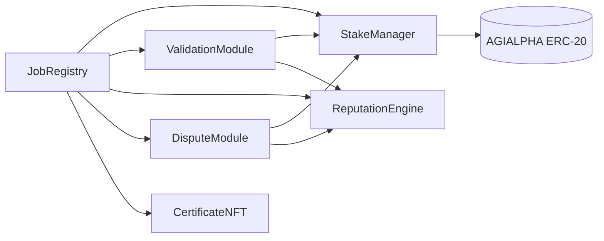
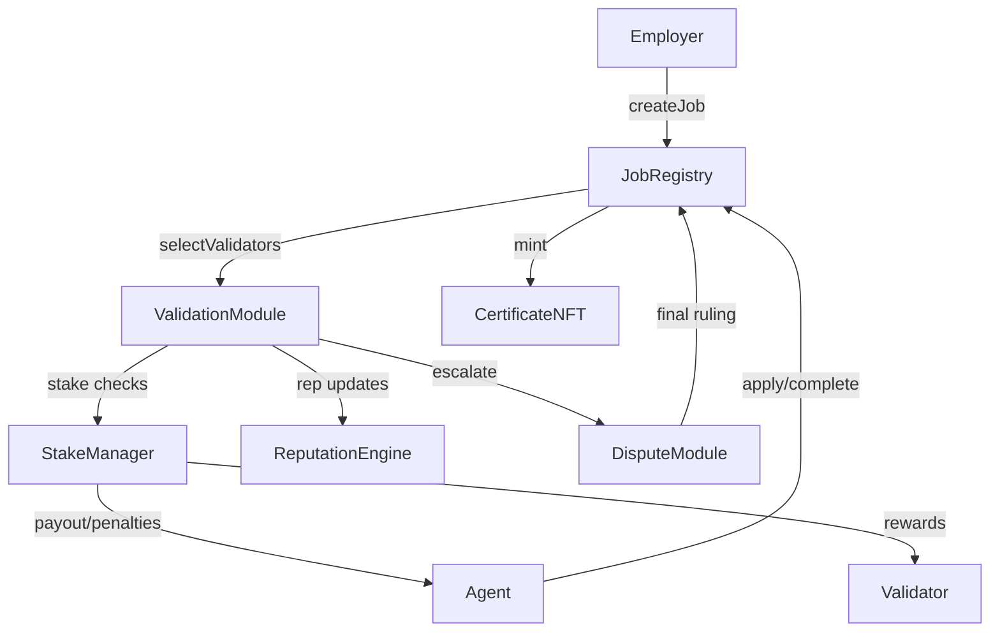
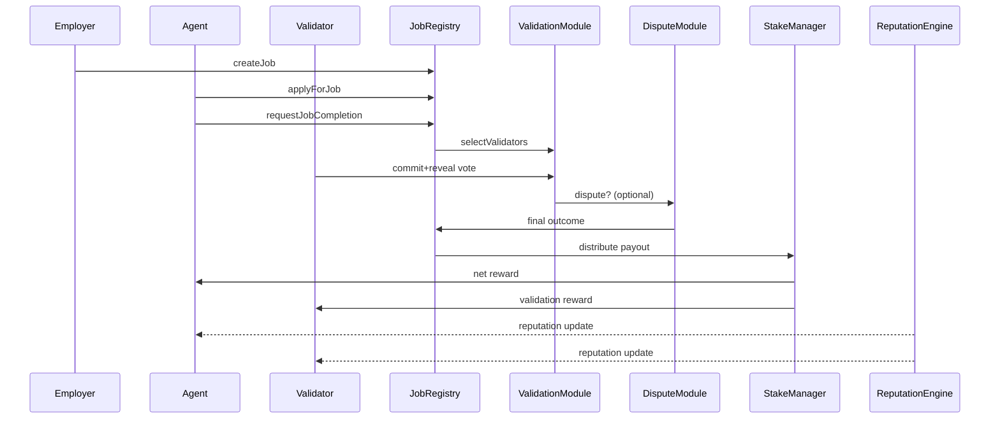
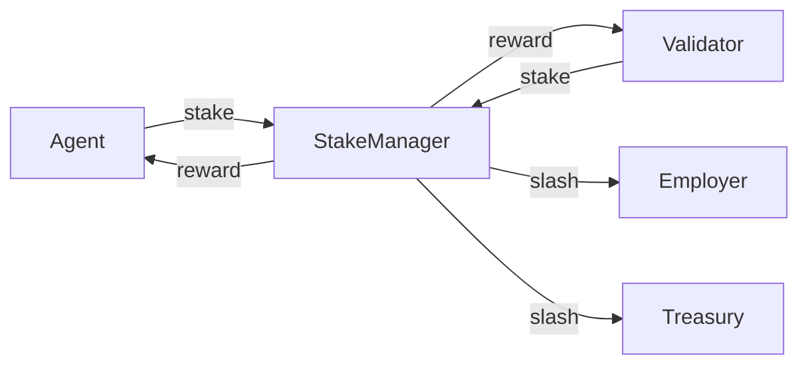

# AGIJobManager v2 Architecture

AGIJobs v2 replaces the monolithic v1 manager with immutable, single-purpose modules. Each contract is deployed once, owns its state, and interacts through a minimal interface so storage layouts remain isolated. The owner (ideally a multisig) can retune parameters or swap module addresses without redeploying the entire suite, delivering governance composability while keeping on-chain logic simple enough for block-explorer interactions. Every module inherits `Ownable`, ensuring only the contract owner can perform privileged actions. The design emphasises gas efficiency and game-theoretic soundness while remaining approachable for non-technical users.

For a quick visual overview of the system, see the [architecture overview](architecture.md).

## Trust assumptions

- **Deterministic randomness** - validator selection uses commit-reveal entropy seeded by the owner and on-chain data. When `block.prevrandao` is unavailable, the module mixes recent block hashes and the caller address, removing any need for off-chain randomness providers.
- **Owner control** - `Ownable` setters let the owner retune parameters at will. Users must trust this address to act in good faith.
- **No external dependencies** - the architecture avoids Chainlink VRF and subscription services entirely.

## Validator pool sizing & gas costs

The validator selection routine uses an in-place Fisher-Yates shuffle, so
gas consumption scales linearly with the candidate pool. Selecting ten
validators from one hundred candidates consumes roughly **2.0M gas**, while
two hundred candidates cost about **3.5M gas**. At ~20k gas per
candidate, we recommend capping the validator pool around **500
validators** to keep `selectValidators` under ~10M gas on mainnet.

## Modules



- **JobRegistry** - posts jobs, escrows payouts and tracks lifecycle state.
- **ValidationModule** - selects validators, orchestrates commit-reveal voting and returns preliminary outcomes.
- **DisputeModule** - optional appeal layer where moderators or a larger validator jury render final decisions.
- **StakeManager** - escrows validator and agent collateral, releases rewards and executes slashing.
- **ReputationEngine** - updates reputation scores and blacklists misbehaving agents or validators.
- **CertificateNFT** - mints ERC-721 proof of completion to employers.
  Each component is immutable once deployed yet configurable by the owner through minimal setter functions, enabling governance upgrades without redeploying the entire suite.

### Token Configuration

`StakeManager` holds the address of the ERC-20 used for all payments, staking and dispute fees. v2 deployments fix this token to $AGIALPHA at `0xA61a3B3a130a9c20768EEBF97E21515A6046a1fA`, which operates with **18 decimals**. All economic parameters (stakes, rewards, fees) must therefore be provided in base units of this token (e.g., `100_000000000000000000` for 100 AGIALPHA). The `DisputeModule` pulls its `disputeFee` from `StakeManager`, so dispute resolution also uses this ERC-20.

| Module           | Core responsibility                                     | Owner-controllable parameters                                          |
| ---------------- | ------------------------------------------------------- | ---------------------------------------------------------------------- |
| JobRegistry      | job postings, escrow, lifecycle management              | job reward, required agent stake                                       |
| ValidationModule | validator selection, commit-reveal voting, finalization | stake ratios, reward/penalty rates, timing windows, validators per job |
| DisputeModule    | optional dispute and moderator decisions                | dispute fee, jury size, moderator address                              |
| StakeManager     | custody of validator/agent collateral and slashing      | minimum stakes, slashing percentages, reward recipients                |
| ReputationEngine | reputation tracking and blacklist enforcement           | reputation thresholds, authorised caller list                          |
| CertificateNFT   | ERC-721 proof of completion                             | base URI                                                               |

Every module inherits `Ownable`, so only the contract owner (or future governance authority) may adjust these parameters.

All public methods accept plain `uint256` values (wei and seconds) so they can be invoked directly from a block explorer without custom tooling. Owners configure modules by calling the published setter functions in Etherscan's **Write** tab, while agents and validators use the corresponding read/write interfaces for routine actions.

### Owner Controls & Explorer Usability

- Every setter is gated by `onlyOwner`, ensuring a single governance address (or multisig) tunes parameters.
- `JobRegistry` can re-point to replacement modules via `setModules`, enabling upgrades without migrating state.
- Functions use primitive types and include NatSpec comments so Etherscan displays human-readable names and prompts.

## Module Interactions



## Job Settlement Flow



## Interface Summary

Key Solidity interfaces live in [`contracts/interfaces`](../contracts/interfaces) and capture the responsibilities of each module. Examples:

```solidity
interface IJobRegistry {
    function createJob(uint256 reward, string calldata uri) external returns (uint256 jobId);
    function applyForJob(uint256 jobId) external;
    function completeJob(uint256 jobId, bytes calldata result) external;
    function finalize(uint256 jobId) external;
    function setModules(
        address validation,
        address reputation,
        address stake,
        address dispute,
        address cert
    ) external;
    function setJobParameters(uint256 reward, uint256 stake) external;
}

interface IValidationModule {
    function selectValidators(uint256 jobId) external returns (address[] memory);
    function commitValidation(uint256 jobId, bytes32 commitHash, string calldata subdomain, bytes32[] calldata proof) external;
    function revealValidation(uint256 jobId, bool approve, bytes32 salt, string calldata subdomain, bytes32[] calldata proof) external;
    function finalize(uint256 jobId) external returns (bool success);
    function setParameters(
        uint256 validatorStakeRequirement,
        uint256 validatorStakePercentage,
        uint256 validatorRewardPercentage,
        uint256 validatorSlashingPercentage,
        uint256 commitDuration,
        uint256 revealDuration,
        uint256 reviewWindow,
        uint256 resolveGracePeriod,
        uint256 validatorsPerJob
    ) external;
}

interface IDisputeModule {
    function raiseDispute(uint256 jobId) external;
    function resolve(uint256 jobId, bool employerWins) external;
    function setAppealParameters(uint256 appealFee, uint256 jurySize) external;
}

interface IReputationEngine {
    function add(address user, uint256 amount) external;
    function subtract(address user, uint256 amount) external;
    function isBlacklisted(address user) external view returns (bool);
    function setCaller(address caller, bool allowed) external;
    function setThreshold(uint256 threshold) external;
    function setBlacklist(address user, bool status) external;
}

interface IStakeManager {
    enum Role { Agent, Validator }
    function depositStake(Role role, uint256 amount) external;
    function withdrawStake(Role role, uint256 amount) external;
    function lockStake(address user, Role role, uint256 payout) external;
    function slash(address user, Role role, uint256 payout, address employer) external; // `employer` must not be zero when employer share > 0
    function setMinStake(uint256 minStake) external;
    function setSlashingPercentages(
        uint256 employerSlashPct,
        uint256 treasurySlashPct
    ) external;
    function setTreasury(address treasury) external; // treasury cannot be zero or owner
}

interface ICertificateNFT {
    function mint(address to, uint256 jobId, string memory uri) external returns (uint256 tokenId);
}
```

## Governance and Owner Controls

Each module exposes minimal `onlyOwner` setters so governance can tune economics without redeploying code. Because `JobRegistry` can update the addresses of its companion modules, new implementations may be introduced piecemeal while existing state remains untouched, enabling governance composability.

| Module           | Key owner functions                                                                                                          | Purpose                                                    |
| ---------------- | ---------------------------------------------------------------------------------------------------------------------------- | ---------------------------------------------------------- |
| JobRegistry      | `setValidationModule`, `setReputationEngine`, `setStakeManager`, `setCertificateNFT`, `setDisputeModule`, `setJobParameters` | Wire module addresses and set per-job rewards/stake        |
| ValidationModule | `setParameters`                                                                                                              | Adjust stake ratios, rewards, slashing and timing windows  |
| DisputeModule    | `setAppealParameters`                                                                                                        | Configure dispute fees, jury size and moderator address    |
| StakeManager     | `setMinStake`, `setSlashingPercentages`, `setTreasury`                                                                       | Tune minimum stake, slashing shares and treasury           |
| ReputationEngine | `setCaller`, `setThreshold`, `setBlacklist`                                                                                  | Authorise callers, set reputation floors, manage blacklist |
| CertificateNFT   | `setJobRegistry`                                                                                                             | Configure authorized JobRegistry                           |

All setters are accessible through block-explorer interfaces, keeping administration intuitive for non-technical owners while preserving contract immutability. These interfaces favour explicit, single-purpose methods, keeping gas costs predictable and allowing front-end or Etherscan interactions to remain intuitive.

### Swapping validation modules

Different validation strategies can be wired into `JobRegistry` by calling `setValidationModule` with the address of the desired implementation:

```solidity
JobRegistry registry = JobRegistry(<registry>);
NoValidationModule fast = new NoValidationModule(registry);
OracleValidationModule oracle = new OracleValidationModule(registry, <oracle>);

// use fast auto-approval for low-stakes jobs
registry.setValidationModule(address(fast));

// later switch to oracle-driven validation
registry.setValidationModule(address(oracle));
```

## User Experience

Non-technical employers, agents and validators can call these methods directly through Etherscan's read and write tabs. Every parameter uses human-readable units (wei for token amounts and seconds for timing) so that wallets and explorers can display values without custom tooling. No external subscription or Chainlink VRF is required; validator selection relies on commit-reveal randomness seeded by the owner.
If a result is contested, employers or agents invoke the DisputeModule's `raiseDispute` through the explorer and a moderator or expanded validator jury finalises the job.

For detailed explorer walk-throughs see [docs/etherscan-guide.md](etherscan-guide.md).

## Incentive Refinements

- Validator stake scales with job value; majority approval finalises after a grace period while minority can trigger an appeal round with a larger validator set.
- Slashing percentages exceed potential rewards so dishonest behaviour is an energy-costly deviation.
- Employers receive a share of slashed agent stake on any failure, aligning interests.
- Sole dissenters that reveal incorrect votes incur extra penalties, discouraging extortion.
- A dedicated DisputeModule coordinates appeals and moderator input, ensuring collusion requires prohibitive stake.
- Parameters (burn rates, stake ratios, validator counts) are tunable by the owner to keep the Nash equilibrium at honest participation.

### Dynamic Validator Committees

Validator count expands with job value to raise collusion costs. An owner-set schedule maps payout tiers to committee sizes:

| Job payout (AGI) | Validators |
| ---------------- | ---------- |
| < 1,000          | 3          |
| 1,000-10,000     | 5          |
| > 10,000         | 7          |

Jobs default to majority rule; ties resolve to success unless appealed. Adjusting the tiers is an owner-only action via `ValidationModule.setParameters`, keeping validator entropy proportional to value at risk.

## Statistical-Physics View

The protocol behaves like a system seeking minimum Gibbs free energy. Honest completion is the ground state in this Hamiltonian system: any actor attempting to cheat must input additional "energy"-manifested as higher expected stake loss-which drives the system back toward the stable equilibrium. Using the thermodynamic analogue

\[ G = H - T S \]

slashing raises the system's enthalpy \(H\) while the commit-reveal process injects entropy \(S\). Owner-tuned parameters act as the temperature \(T\), weighting how much randomness counterbalances potential gains from deviation. When parameters are calibrated so that \(G\) is minimised at honest behaviour, rational participants naturally settle into that state.

### Hamiltonian and Game Theory

We can sketch a simplified Hamiltonian

\[ H = \sum_i s_i - \sum_j r_j \]

where \(s_i\) represents stake lost by misbehaving participants and \(r_j\) denotes rewards for correct actions. The owner adjusts coefficients through setter functions, shaping the potential landscape so that the minimal free energy occurs when agents, validators and employers follow the protocol. Deviations raise \(H\), matching game-theoretic expectations that dishonest strategies carry higher expected cost than cooperative ones.

### Incentive Flow Diagram



The flow highlights how collateral enters the system and where it is routed on success or failure. Rewards are paid out of escrow while slashed stakes are split between the employer and treasury, ensuring misbehaviour carries an immediate, quantifiable cost.

## Interfaces

Reference Solidity interfaces are provided in `contracts/interfaces` for integration and future implementation.

## Solidity Structure Recommendations

- Prefer immutable module addresses, cache them locally during calls, and minimise storage writes for gas efficiency.
- Use `uint256` for amounts and timestamps and pack related structs to reduce storage slots; counters can downsize to `uint64` or `uint128` when safe.
- Favour `external` functions and `calldata` parameters for user interactions.
- Isolate permissioned setters with `onlyOwner` modifiers and emit update events for every configuration change.
- Guard external state-changing functions with `nonReentrant` in `StakeManager` and `JobRegistry`.
- Avoid external libraries requiring subscriptions; commit-reveal randomness keeps the system trust-minimised.
- Separate state-changing logic from read-only helpers to simplify audits and Etherscan interactions.
- Use custom errors instead of revert strings to save deployment and runtime gas.
- Where arithmetic is already bounds-checked, wrap operations in `unchecked` blocks for marginal savings.

### Additional Gas Optimization Tips

- Enable the Solidity optimizer with high `runs` to reduce bytecode size.
- Group related storage writes to minimise `SSTORE` operations.
- Declare configuration constants as `immutable` or `constant` to cut storage reads.

## Compliance note

Although rewards settle on-chain, builders and users remain responsible for obeying the laws and regulations of their local jurisdictions. This document does not constitute legal or tax advice.
