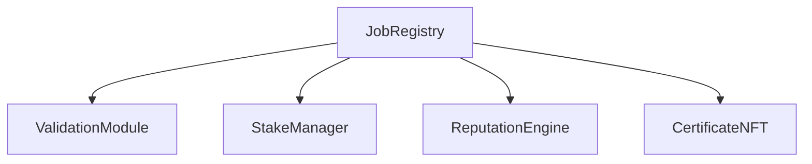
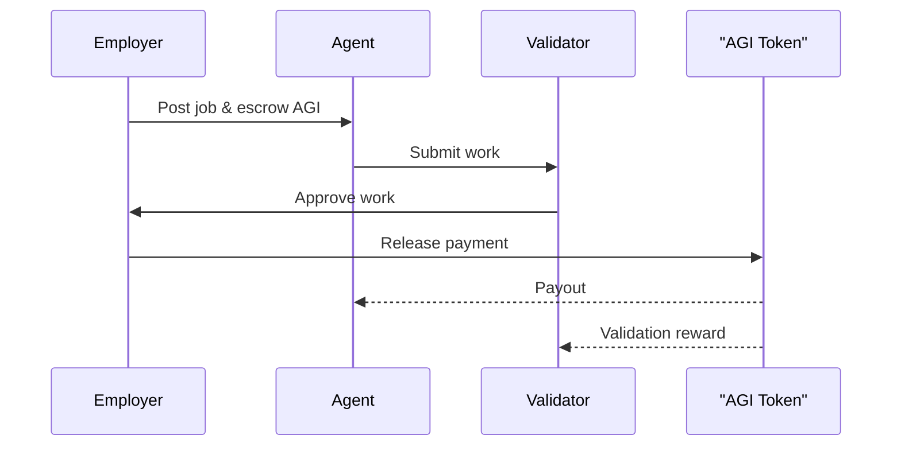
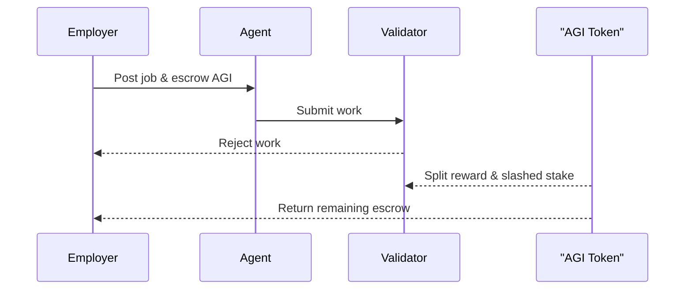

# Architecture Overview

This document offers a quick visual summary of the AGI Jobs v2 system for
readers who want a high-level picture. For a detailed breakdown of module
responsibilities, owner controls and design rationale, see
[architecture-v2.md](architecture-v2.md).

## Modules

AGI Jobs v2 decomposes functionality into small, single-purpose contracts. For
depth on how each component works, jump to the corresponding section in the
[architecture-v2](architecture-v2.md) guide.

- [JobRegistry](../contracts/JobRegistry.sol) – orchestrates job lifecycle
  and coordinates with external modules.
- [StakeManager](../contracts/StakeManager.sol) – holds deposits, pays
  rewards, and slashes stake.
- [ReputationEngine](../contracts/ReputationEngine.sol) – tracks reputation
  scores for participants.
- [ValidationModule](../contracts/ValidationModule.sol) – returns preset
  validation outcomes for jobs.
- [CertificateNFT](../contracts/CertificateNFT.sol) – mints ERC721
  certificates for successful jobs.

## Module Interactions

## Job Flow

## Employer-Win Dispute Flow

