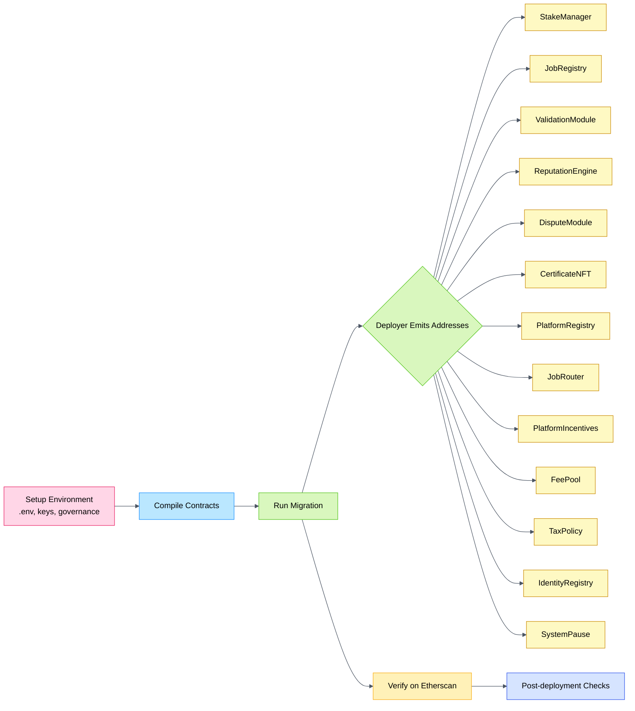

# Deploying AGIJobs v2 to Ethereum Mainnet (CLI Guide)

This guide walks through deploying the complete AGIJobs v2 stack to Ethereum mainnet using [Truffle](https://trufflesuite.com). It assumes you are preparing a production deployment and want the full suite of contracts wired together in one command.

## Deployment flow



The diagram illustrates how the `Deployer` contract fans out into every core module powering AGIJobs v2.

## Prerequisites

- **Node.js 20.x & npm 10+** – run `nvm use` to match the version in `.nvmrc`.
- **Install dependencies** – clone the repository and run `npm install`.
- **Truffle & plugins** – Truffle is already configured in `truffle-config.js` with the `truffle-plugin-verify` plugin. No global install is required; use the local `npx truffle` binary.
- **Mainnet RPC & key** – set `MAINNET_RPC_URL` and `MAINNET_PRIVATE_KEY` in a `.env` file. The private key funds must cover deployment gas.
- **Governance multisig/timelock** – export `GOVERNANCE_ADDRESS` with the address that should own the system.
- **Etherscan key** – set `ETHERSCAN_API_KEY` so `truffle-plugin-verify` can verify contracts.
- **Optional parameters** – `FEE_PCT`, `BURN_PCT`, or `NO_TAX` can override default economics.
- **Testnet dry‑run** – always run the migration on a public testnet such as Sepolia with the same environment variables before attempting mainnet.
- **AGIALPHA token** – the token address, ERC‑20 metadata (symbol/name) and decimals are fixed in `config/agialpha.json` and compiled into the contracts; no extra configuration is required.

### ENS namehash preparation

Before running any migrations ensure the ENS root configuration is in sync:

1. Update `deployment-config/<network>.json` with the ENS names you intend to gate (`agentRoot`, `clubRoot`, `alphaClubRoot`).
2. Run the helper to recompute the namehashes:

   ```bash
   npm run namehash:sepolia   # testnet dry-run
   npm run namehash:mainnet   # production config
   ```

   The script normalises the configured names and rewrites the `hash` fields in-place. Commit the resulting JSON so migrations pick up the latest values.
3. Add the helper to CI (for example as a linting step that runs the command and asserts the working tree stays clean) so stale hashes are caught before a deployment window.

This workflow mirrors the on-chain expectations of `IdentityRegistry` and prevents drift between the documented ENS roots and the values deployed to production.

Example `.env`:

```env
MAINNET_RPC_URL=https://mainnet.infura.io/v3/<key>
MAINNET_PRIVATE_KEY=0xabc...
GOVERNANCE_ADDRESS=0xYourMultisig
ETHERSCAN_API_KEY=<etherscan key>
FEE_PCT=5
BURN_PCT=5
#NO_TAX=1
```

### Truffle configuration

`truffle-config.js` reads the environment variables above to configure the mainnet network using `HDWalletProvider`:

```javascript
// truffle-config.js
module.exports = {
  networks: {
    mainnet: {
      provider: () =>
        new HDWalletProvider(
          process.env.MAINNET_PRIVATE_KEY,
          process.env.MAINNET_RPC_URL
        ),
      network_id: 1,
      confirmations: 2,
      timeoutBlocks: 200,
      skipDryRun: true,
    },
  },
};
```

## Compile

Compile contracts:

```bash
npx truffle compile
```

## Deploy

Run the migration on mainnet. The script deploys all modules, wires them together and prints each address.

```bash
npx truffle migrate --network mainnet
```

Dry‑run first on a testnet with the same parameters:

```bash
npx truffle migrate --network sepolia
```

Set `NO_TAX=1` in the environment to omit the `TaxPolicy` module.

## Verify

Verification is a separate step. After the migration completes, run the `truffle-plugin-verify` command:

```bash
npx truffle run verify Deployer StakeManager JobRegistry ValidationModule \
  ReputationEngine DisputeModule CertificateNFT PlatformRegistry JobRouter \
  PlatformIncentives FeePool IdentityRegistry SystemPause --network mainnet
```

This example verifies all core contracts. Include `TaxPolicy` at the end if it was deployed. The migration script can also invoke this command automatically when `ETHERSCAN_API_KEY` is set, but you can rerun it at any time to retry verification.

## Post-deployment

1. Confirm each module’s owner or governance address matches your multisig.
2. Keep a record of the printed addresses; they are required for clients and future governance actions.
3. Use `npm run wire:verify -- --network <network>` to sanity‑check that contracts
   reference one another correctly and match the values in `config/agialpha.<network>.json`
   and `config/ens.<network>.json`.
4. Exercise the `SystemPause` contract to ensure emergency controls work.
5. Be prepared to call `SystemPause.pauseAll()` from your governance address in emergencies.

## Migration script

The mainnet deployment uses the following Truffle migration:

```javascript
const Deployer = artifacts.require('Deployer');

module.exports = async function (deployer, network, accounts) {
  const governance = process.env.GOVERNANCE_ADDRESS || accounts[0];
  const withTax = !process.env.NO_TAX;
  const feePct = process.env.FEE_PCT ? parseInt(process.env.FEE_PCT) : 5;
  const burnPct = process.env.BURN_PCT ? parseInt(process.env.BURN_PCT) : 5;

  await deployer.deploy(Deployer);
  const instance = await Deployer.deployed();

  const ids = {
    ens: '0x00000000000C2E074eC69A0dFb2997BA6C7d2e1e',
    nameWrapper: '0xD4416b13d2b3a9aBae7AcD5D6C2BbDBE25686401',
    clubRootNode:
      '0x39eb848f88bdfb0a6371096249dd451f56859dfe2cd3ddeab1e26d5bb68ede16',
    agentRootNode:
      '0x2c9c6189b2e92da4d0407e9deb38ff6870729ad063af7e8576cb7b7898c88e2d',
    validatorMerkleRoot: '0x' + '0'.repeat(64),
    agentMerkleRoot: '0x' + '0'.repeat(64),
  };

  const econ = {
    feePct,
    burnPct,
    employerSlashPct: 0,
    treasurySlashPct: 0,
    commitWindow: 0,
    revealWindow: 0,
    minStake: 0,
    jobStake: 0,
  };

  let receipt;
  if (withTax) {
    if (feePct !== 5 || burnPct !== 5) {
      receipt = await instance.deploy(econ, ids, governance);
    } else {
      receipt = await instance.deployDefaults(ids, governance);
    }
  } else {
    if (feePct !== 5 || burnPct !== 5) {
      receipt = await instance.deployWithoutTaxPolicy(econ, ids, governance);
    } else {
      receipt = await instance.deployDefaultsWithoutTaxPolicy(ids, governance);
    }
  }

  const log = receipt.logs.find((l) => l.event === 'Deployed');
  const args = log.args;
  console.log('Deployer:', instance.address);
  console.log('StakeManager:', args.stakeManager);
  console.log('JobRegistry:', args.jobRegistry);
  console.log('ValidationModule:', args.validationModule);
  console.log('ReputationEngine:', args.reputationEngine);
  console.log('DisputeModule:', args.disputeModule);
  console.log('CertificateNFT:', args.certificateNFT);
  console.log('PlatformRegistry:', args.platformRegistry);
  console.log('JobRouter:', args.jobRouter);
  console.log('PlatformIncentives:', args.platformIncentives);
  console.log('FeePool:', args.feePool);
  if (withTax) {
    console.log('TaxPolicy:', args.taxPolicy);
  }
  console.log('IdentityRegistry:', args.identityRegistryAddr);
  console.log('SystemPause:', args.systemPause);

  if (process.env.ETHERSCAN_API_KEY) {
    const contracts = [
      'Deployer',
      'StakeManager',
      'JobRegistry',
      'ValidationModule',
      'ReputationEngine',
      'DisputeModule',
      'CertificateNFT',
      'PlatformRegistry',
      'JobRouter',
      'PlatformIncentives',
      'FeePool',
      'IdentityRegistry',
      'SystemPause',
    ];
    if (withTax) {
      contracts.push('TaxPolicy');
    }
    try {
      const { execSync } = require('child_process');
      const cmd = `npx truffle run verify ${contracts.join(
        ' '
      )} --network ${network}`;
      console.log('Running:', cmd);
      execSync(cmd, { stdio: 'inherit' });
    } catch (err) {
      console.error('Verification failed:', err.message);
    }
  } else {
    console.log('ETHERSCAN_API_KEY not set; skipping auto-verify.');
  }
};
```

This script is stored at `migrations/2_deploy_agijobs_v2.js` and is ready for production use.
