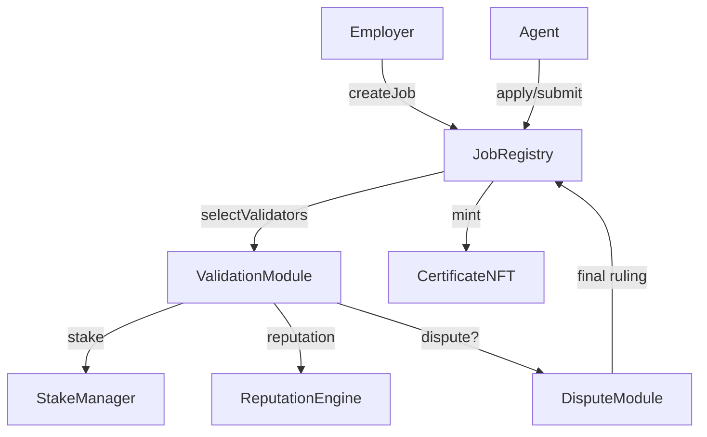

# Etherscan Interaction Guide

For a narrated deployment walkthrough, see [deployment-v2-agialpha.md](deployment-v2-agialpha.md).

## Quick Links

- AGIJobManager v0: [Etherscan](https://etherscan.io/address/0x0178b6bad606aaf908f72135b8ec32fc1d5ba477#code) | [Blockscout](https://blockscout.com/eth/mainnet/address/0x0178b6bad606aaf908f72135b8ec32fc1d5ba477/contracts)
- $AGIALPHA Token: [Etherscan](https://etherscan.io/address/0xA61a3B3a130a9c20768EEBF97E21515A6046a1fA#code) | [Blockscout](https://eth.blockscout.com/address/0xA61a3B3a130a9c20768EEBF97E21515A6046a1fA?tab=contract)

> **Tax Note:** The contracts and their owner are globally tax‑exempt; employers, agents, and validators shoulder all tax duties. Each module exposes `isTaxExempt()` for verification.

> **Base units:** $AGIALPHA uses 18 decimals. Enter amounts as integers (`1` token = `1_000000000000000000`, `0.5` token = `500000000000000000`, `0.1` token = `100000000000000000`).

## Deploy v2 Modules

1. Open the [`Deployer`](../contracts/Deployer.sol) contract on Etherscan and connect a wallet under **Write Contract**.
2. Execute **deployDefaults(ids)**; blank fields use `$AGIALPHA` and baked‑in economics while wiring all modules. The caller becomes the owner.
3. Legacy deployments allowed token swaps, but new systems assume a fixed token and no longer expose those functions.

## Role Function Quick Reference

| Role      | Required function calls                                                                                                           | Example amounts (18 decimals)                                |
| --------- | ---------------------------------------------------------------------------------------------------------------------------------- | ------------------------------------------------------------ |
| Employer  | `$AGIALPHA.approve(StakeManager, 1_050000000000000000)` → `JobRegistry.acknowledgeTaxPolicy()` → `JobRegistry.createJob(1_000000000000000000, deadline, specHash, uri)` → `JobRegistry.acknowledgeAndFinalize(jobId)` | approve `1_050000000000000000` for a 1‑token reward + 5% fee |
| Agent     | `$AGIALPHA.approve(StakeManager, 1_000000000000000000)` → `JobRegistry.stakeAndApply(jobId, 1_000000000000000000)`                | stake `1_000000000000000000`                                 |
| Validator | `$AGIALPHA.approve(StakeManager, 1_000000000000000000)` → `StakeManager.depositStake(1, 1_000000000000000000)` → `ValidationModule.commitValidation(jobId, hash, sub, proof)` → `ValidationModule.revealValidation(jobId, approve, burnTxHash, salt, sub, proof)` | stake `1_000000000000000000`                                 |
| Disputer  | `$AGIALPHA.approve(StakeManager, 1_000000000000000000)` → `JobRegistry.acknowledgeAndDispute(jobId, evidence)` → `DisputeModule.resolve(jobId, uphold, signatures)` (majority moderators or owner) | dispute fee `1_000000000000000000`                           |

## ENS prerequisites

- Agents need an ENS subdomain ending in `.agent.agi.eth`; validators require `.club.agi.eth`.
- Membership can be proven off‑chain by calling [`ENSOwnershipVerifier.verifyOwnership`](../contracts/modules/ENSOwnershipVerifier.sol) with your address, subdomain label, and Merkle proof.
  Project operators can issue subdomains and set resolver records as
  described in [ens-identity-setup.md](ens-identity-setup.md).

## Calling Contract Methods via Etherscan

1. **Connect to Web3** – open the contract on Etherscan, select the **Write Contract** tab, click **Connect to Web3**, and approve the connection. The page displays your wallet address once connected.
2. **depositStake** – on `StakeManager`, enter the role and amount (18‑decimal base units) in `depositStake(role, amount)` and click **Write**.

   ```text
   depositStake(1, 1000000000000000000)
   ```

3. **stakeAndActivate** – visit the `PlatformIncentives` address, connect, enter the stake amount, and press **Write** on `stakeAndActivate(amount)`.

   ```text
   stakeAndActivate(1000000000000000000)
   ```

4. **burn, confirm & acknowledgeAndFinalize** – from the employer wallet, burn the required fee share of `$AGIALPHA`, submit the receipt, call `JobRegistry.confirmEmployerBurn(jobId, txHash)`, and then call `JobRegistry.acknowledgeAndFinalize(jobId)` to settle a validated job. The platform never finalizes jobs or collects burned tokens.

   ```text
   acknowledgeAndFinalize(1)
   ```

5. **distributeFees** – on the `FeePool` contract, call `distributeFees()` to allocate pending fees to stakers.

   ```text
   distributeFees()
   ```

6. **claimRewards** – still in `FeePool`, execute `claimRewards()` to withdraw accrued rewards.

   ```text
   claimRewards()
   ```

7. **acknowledgeAndDispute** – if contesting a job, approve the `StakeManager` for the `appealFee` and call `JobRegistry.acknowledgeAndDispute(jobId, evidence)`.

## Employer Burn Flow via Etherscan

Employers must burn their own tokens before a job can be finalized. The entire
sequence happens from the employer's wallet using Etherscan:

1. **Burn tokens** – open the `$AGIALPHA` token contract, connect to Web3 and
   call `burn(amount)` for the fee + burn share. After the transaction
   confirms, record the transaction hash and the block number from the
   Etherscan receipt page.
2. **Submit burn receipt** – return to `JobRegistry` and call
   `submitBurnReceipt(jobId, burnTxHash, amount, blockNumber)` using the values
   from step 1.
3. **Confirm burn** – still on `JobRegistry`, call
   `confirmEmployerBurn(jobId, burnTxHash)`.
4. **Finalize** – call `acknowledgeAndFinalize(jobId)` to release payment and
   burn the platform fee. If a burn receipt or confirmation is missing the
   transaction reverts, ensuring only employers can complete this flow.

### Sample Owner Parameters

When using the **Write Contract** tab as the owner, populate fields with explicit values.
Emergency withdrawals must be scheduled and executed by the timelock via `governanceWithdraw`:

| Contract       | Function                                        | Example parameters                                                  |
| -------------- | ----------------------------------------------- | ------------------------------------------------------------------- |
| `StakeManager` | `setFeePct(pct)`                                | `20`                                                                |
| `JobRegistry`  | `setFeePct(pct)`                                | `5`                                                                 |
| `TaxPolicy`    | `setPolicyURI("ipfs://Qm...")`                  | `ipfs://QmPolicyHash`                                               |
| `FeePool`      | `governanceWithdraw(to, amount)` (via timelock) | `0x1111111111111111111111111111111111111111`, `1000000000000000000` |

## Module Addresses & Roles

| Module           | Address | Role                                                 |
| ---------------- | ------- | ---------------------------------------------------- |
| JobRegistry      | _TBD_   | Posts jobs, escrows payouts, tracks lifecycle        |
| ValidationModule | _TBD_   | Selects validators and runs commit‑reveal voting     |
| StakeManager     | _TBD_   | Custodies collateral and executes slashing           |
| ReputationEngine | _TBD_   | Updates reputation scores and applies penalties      |
| DisputeModule    | _TBD_   | Handles appeals and renders final rulings            |
| CertificateNFT   | _TBD_   | Mints ERC‑721 certificates for completed jobs        |
| TaxPolicy        | _TBD_   | Stores tax disclaimer URI and acknowledgement helper |

> Addresses will be published after deployment. Always verify each on multiple explorers before interacting.

## Role & Staking Summary

- **Employer** – posts jobs and escrows rewards.
- **Agent** – calls `StakeManager.depositStake(0, amount)` and completes work.
- **Validator** – calls `StakeManager.depositStake(1, amount)` and votes on jobs.
- **Platform operator** – stakes with `depositStake(2, amount)` then `PlatformRegistry.register()` for routing and fees.

**Fee Claiming** – trigger `FeePool.distributeFees()` and withdraw with `FeePool.claimRewards()`.

_Zero‑stake deployer_ – the owner may register with `0` stake to appear in `PlatformRegistry` without routing weight or rewards.

## Module Diagram



## Deployment Order

Deploy modules sequentially so later contracts can reference earlier addresses.

| #   | Module           | Purpose                                             |
| --- | ---------------- | --------------------------------------------------- |
| 1   | StakeManager     | Custodies escrowed rewards and participant stakes.  |
| 2   | JobRegistry      | Posts jobs and routes calls between modules.        |
| 3   | ValidationModule | Runs commit–reveal voting and selects validators.   |
| 4   | ReputationEngine | Tracks good or bad performance for each address.    |
| 5   | DisputeModule    | Handles appeals when validation is contested.       |
| 6   | CertificateNFT   | Issues completion certificates for finished jobs.   |
| 7   | TaxPolicy        | Stores the tax disclaimer and acknowledgement text. |

## Role-based Instructions

Before performing any on-chain action, employers, agents, and validators must call `JobRegistry.acknowledgeTaxPolicy` and verify `isTaxExempt()`—all taxes fall on participants while the contracts and owner remain globally exempt. The `acknowledgeTaxPolicy` transaction emits `TaxAcknowledged(user, version, acknowledgement)` so the accepted disclaimer text is permanently recorded on-chain.

### Employers

1. Open the `JobRegistry` address on Etherscan.
2. In **Write Contract**, connect an employer wallet and execute **acknowledgeTaxPolicy**, then review the `TaxAcknowledged` event log for the disclaimer text.
3. In **Read Contract**, confirm **isTaxExempt()** returns `true`.
4. Call **createJob(reward, deadline, specHash, uri)** after approving the StakeManager for `reward + fee` (fee = `reward * feePct / 100`).
5. Monitor **JobCreated** events to confirm posting.
6. After validation and any disputes, the employer burns the fee share then calls **acknowledgeAndFinalize(jobId)** from their wallet to release payments.

### Agents

1. On `JobRegistry`, execute **acknowledgeTaxPolicy** and verify **isTaxExempt()**. Check the emitted `TaxAcknowledged` event for the recorded disclaimer.
2. Open `StakeManager`; in **Read Contract** confirm **isTaxExempt()**, then stake with **depositStake(0, amount)** (role `0` = Agent).

   ```text
   depositStake(0, amount)
   ```

3. Use **applyForJob** then **submit(jobId, resultHash, uri)** when work is ready.
4. After validators reveal votes, wait for the employer to burn the fee share and call **JobRegistry.acknowledgeAndFinalize(jobId)** to settle the job.

### Validators

1. On `JobRegistry`, execute **acknowledgeTaxPolicy** and verify **isTaxExempt()**. Inspect the `TaxAcknowledged` event log for the acknowledgement text.
2. Stake required AGI via **StakeManager.depositStake(1, amount)** after confirming **StakeManager.isTaxExempt()**.

   ```text
   depositStake(1, amount)
   ```

3. During validation, open `ValidationModule`, confirm **isTaxExempt()**, and send hashed votes with **commitValidation(jobId, commitHash, subdomain, proof)**.
4. Reveal decisions using **revealValidation(jobId, approve, burnTxHash, salt, subdomain, proof)** before the window closes.

### Tax Policy

The `TaxPolicy` contract is informational only: it never holds funds and imposes no tax liability on the infrastructure or its owner. The contracts and owner are globally tax‑exempt while employers, agents, and validators shoulder all tax duties and must acknowledge the policy before staking, voting, or appealing.

#### Participants: verify and acknowledge

1. Open [`JobRegistry` on Etherscan](https://etherscan.io/address/0x0178b6bad606aaf908f72135b8ec32fc1d5ba477#readContract).
2. In **Read Contract**, call **taxPolicyDetails** to view the canonical policy URI and acknowledgement text.

   ```text
   taxPolicyDetails() => (version, "ipfs://QmPolicyHash", "Acknowledgement text")
   ```

3. Still under **Read Contract**, call **isTaxExempt** and confirm it returns `true`.
4. Switch to **Write Contract**, connect your wallet, and execute **acknowledgeTaxPolicy**. The transaction log will show `TaxAcknowledged(user, version, acknowledgement)` with the disclaimer you accepted.
5. Back in **Read Contract**, open the `TaxPolicy` contract and call **hasAcknowledged(address)** to ensure it returns `true`.

#### Owner: update the policy

1. Open the `TaxPolicy` contract at its deployment address (replace `<TaxPolicyAddress>`): [Etherscan](https://etherscan.io/address/0x0000000000000000000000000000000000000000#writeContract).
2. In **Write Contract**, connect the multisig/owner wallet.
3. Call **setPolicyURI(newURI)** to change only the policy document.
4. Call **setAcknowledgement(newMessage)** to revise the acknowledgement text.
5. Call **setPolicy(newURI, newMessage)** to update both fields in one transaction.
6. After any update, call **bumpPolicyVersion** on `TaxPolicy` so participants must re‑acknowledge.

### Disputers

1. Ensure you've acknowledged the tax policy and confirmed **isTaxExempt()** on both `JobRegistry` and `DisputeModule`.
2. Approve the `StakeManager` for the configured `appealFee` in `$AGIALPHA` and call `JobRegistry.acknowledgeAndDispute(jobId, evidence)` from the **Write Contract** tab.
3. After the ruling, verify **DisputeResolved** in the `DisputeModule` and `JobRegistry` event logs.

## Common Etherscan Flows

### Approve $AGIALPHA

1. Navigate to the [$AGIALPHA token](https://etherscan.io/address/0xA61a3B3a130a9c20768EEBF97E21515A6046a1fA#writeContract).
2. In **Write Contract**, connect your wallet and call **approve(spender, amount)**. Use 18‑decimal base units (e.g., `1_000000000000000000` for one token).

### Acknowledge the tax policy

1. Open `JobRegistry` → **Write**.
2. Connect and execute **acknowledgeTaxPolicy()**; check the transaction log for `TaxAcknowledged`.

### Apply with subdomain and proof

1. Verify your ENS ownership via `ENSOwnershipVerifier.verifyOwnership` if needed.
2. On `JobRegistry` → **Write**, call **applyForJob(jobId, subdomain, proof)** or **stakeAndApply(jobId, amount)** after approving the stake.

### Commit & reveal validation votes

1. During the commit window open `ValidationModule` → **Write** and call **commitValidation(jobId, hash, subdomain, proof)**.
2. When the reveal window opens, call **revealValidation(jobId, approve, burnTxHash, salt, subdomain, proof)** from the same address.

### Raise & resolve disputes

1. Approve the dispute fee on `$AGIALPHA`.
2. On `JobRegistry` → **Write**, call **acknowledgeAndDispute(jobId, evidence)**.
3. A majority of moderators (or the owner) finalizes by calling **resolve(jobId, uphold, signatures)** on `DisputeModule`.

### List & purchase NFTs

1. To list a certificate, open `CertificateNFT` → **Write** and call **approve(marketplace, tokenId)** or **setApprovalForAll(operator, true)**.
2. Buyers acquire a token by calling **safeTransferFrom(owner, buyer, tokenId)** after approval.

## Function Reference

### JobRegistry

To wire deployed modules, call `setModules(validationModule, stakeManager, reputationEngine, disputeModule, certificateNFT, feePool, new address[](0))`. The final array `_ackModules` lists modules that must acknowledge the tax policy before interacting.

#### Link the identity registry

After wiring modules, the governance/owner account must associate the identity registry by calling:

```
JobRegistry.setIdentityRegistry(identityRegistry)
ValidationModule.setIdentityRegistry(identityRegistry)
```

Linking enables ENS subdomain checks and membership proofs through a shared registry. Once connected, configure the ENS name and its Merkle root within the registry to reflect permitted subdomains and the current member set.

| Function                                                                                                                                         | Parameters                                                  | Typical Use Case                                            |
| ------------------------------------------------------------------------------------------------------------------------------------------------ | ----------------------------------------------------------- | ----------------------------------------------------------- |
| `createJob(uint256 reward, uint64 deadline, bytes32 specHash, string uri)` | `reward` – escrowed tokens, `deadline` – unix time, `specHash` – metadata hash, `uri` – job reference | Employer posts a new job and locks `reward + fee`. |
| `acknowledgeTaxPolicy()`                                                                                                                         | none                                                        | Participant confirms tax disclaimer before interacting.     |
| `acknowledgeAndFinalize(uint256 jobId)`                                                                                                          | `jobId` – job reference                                     | Employer finalizes a validated job and burns the fee share. |
| `setModules(address validation, address stake, address reputation, address dispute, address certificate, address feePool, address[] ackModules)` | module addresses and ack modules                            | Owner wires modules and sets acknowledgement requirements.  |

### StakeManager

| Function                                                       | Parameters                                                   | Typical Use Case                                                                                                      |
| -------------------------------------------------------------- | ------------------------------------------------------------ | --------------------------------------------------------------------------------------------------------------------- |
| `depositStake(uint8 role, uint256 amount)`                     | `role` – 0 Agent, 1 Validator, 2 Platform; `amount` – tokens | Participants bond tokens for their role.                                                                              |
| `slash(address offender, address beneficiary, uint256 amount)` | offending address, beneficiary address, amount | Owner penalises misbehaviour and redirects stake. Beneficiary cannot be the zero address if an employer share is due. |
### ValidationModule

| Function                                            | Parameters                                        | Typical Use Case                                    |
| --------------------------------------------------- | ------------------------------------------------- | --------------------------------------------------- |

| `commitValidation(uint256 jobId, bytes32 hash, string subdomain, bytes32[] proof)` | `jobId`, `hash`, validator ENS subdomain, optional proof | Validator submits a hashed vote during commit window. |
| `revealValidation(uint256 jobId, bool verdict, bytes32 burnTxHash, bytes32 salt, string subdomain, bytes32[] proof)` | jobId, verdict, burn receipt hash, salt, ENS label, optional proof | Validator reveals vote before the reveal window closes. |

### DisputeModule

| Function                                                  | Parameters                         | Typical Use Case                                      |
| --------------------------------------------------------- | ---------------------------------- | ----------------------------------------------------- |
| `raiseDispute(uint256 jobId, string reason)`              | jobId, reason URI                  | Participant appeals a validation outcome.             |
| `resolve(uint256 jobId, bool uphold, bytes[] signatures)` | jobId, ruling, moderator approvals | Finalise dispute via majority vote or owner override. |
| `setDisputeFee(uint256 fee)`                              | fee amount                         | Owner adjusts the dispute bond charged on disputes.   |

## Parameter Glossary

| Parameter                    | Description                                                  |
| ---------------------------- | ------------------------------------------------------------ |
| `commitWindow`               | Seconds allowed for validators to submit hashed votes.       |
| `revealWindow`               | Seconds validators have to reveal votes.                     |
| `reviewWindow`               | Delay before validation begins.                              |
| `resolveGracePeriod`         | Buffer after reveal before anyone can resolve a stalled job. |
| `burnPercentage`             | Portion of payout burned on job finalization (basis points). |
| `validationRewardPercentage` | Share of payout granted to correct validators.               |
| `cancelRewardPercentage`     | Share awarded to the caller when cancelling expired jobs.    |

## Operational Warnings

- Gas costs rise with complex calls and network congestion; budget extra ETH for `acknowledgeAndFinalize` or `setModules`.
- Commit and reveal phases have strict windows; missing a window can forfeit rewards or trigger slashing.
- Raising a dispute requires an `appealFee` bond in the `DisputeModule`; losing an appeal may forfeit this bond.

## Security Warnings

- Contracts are unaudited; interact at your own risk.
- Verify contract and token addresses on multiple explorers.
- Prefer hardware wallets for privileged actions.

## Governance Notes

- All modules are owned by a community multisig. Only the owner may call parameter‑setting functions.
- To update parameters, open the module's **Write** tab and submit the relevant setter transaction from the multisig.
- After each change, verify emitted events and new values on at least two block explorers.

## Verification Checklist

- [ ] Confirm addresses and bytecode match official releases.
- [ ] Cross-check transactions on at least two block explorers.
- [ ] Review parameter settings via read functions before calling write methods.
- [ ] Ensure the AGIALPHA token address `0xA61a3B3a130a9c20768EEBF97E21515A6046a1fA` matches the token in your wallet.

---

_Regulatory note: this guide is informational only and does not constitute legal or tax advice. See [tax-obligations.md](tax-obligations.md) for details on participant responsibilities._
