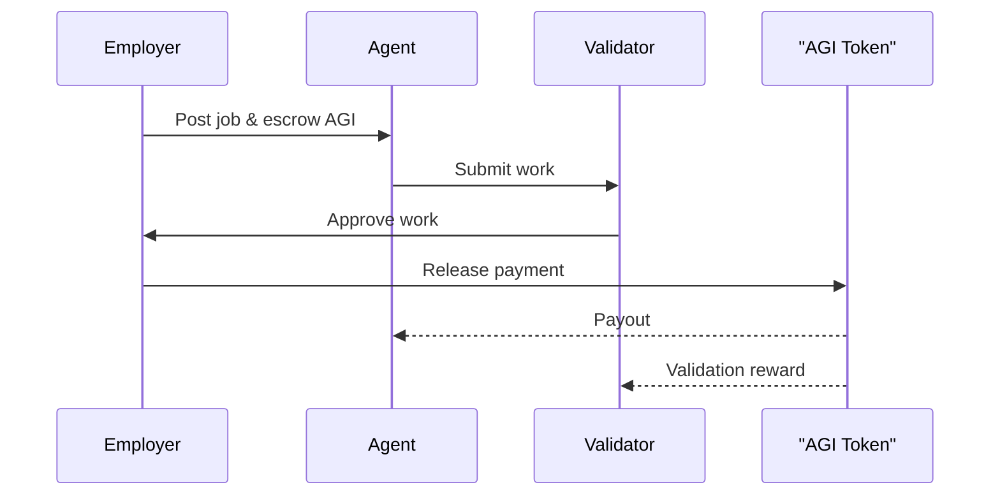
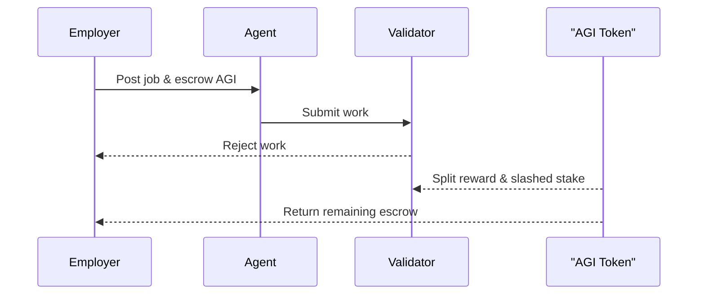

> **Note:** This document is for internal planning purposes only.

# Project Purpose

AGIJob Manager is a foundational smart-contract component for the emerging Economy of AGI. The v0 contract coordinates work between **AGI Agents** and **AGI Nodes**, using the $AGI utility token as the medium of exchange. Agents perform computational jobs, Nodes supply the processing power, and $AGI rewards flow through the system to fuel a decentralized network of autonomous services.

## Employer-Win Dispute Flow

For a standalone diagram, see [architecture.md](architecture.md).
