```mermaid
flowchart TB
%% ============================================================
%%  AGI JOBS v2 — ETHEREUM MAINNET VIA ETHERSCAN (ASI EDITION)
%%  Iconic • Incredible • Vibrant • No-Code • Civilizational-Scale
%% ============================================================

%% ---------- THEMES ----------
classDef banner fill:#0b0f19,stroke:#60a5fa,color:#e5e7eb,stroke-width:2px,font-weight:bold
classDef phase  fill:#0f172a,stroke:#22d3ee,color:#e2e8f0,stroke-width:2px,font-weight:bold
classDef step   fill:#06b6d4,stroke:#f0f9ff,color:#031017,stroke-width:1px
classDef prime  fill:#22c55e,stroke:#bbf7d0,color:#06210f,stroke-width:1px,font-weight:bold
classDef warn   fill:#fde047,stroke:#713f12,color:#1a1603,stroke-width:1px
classDef danger fill:#ef4444,stroke:#7f1d1d,color:#1f0a0a,stroke-width:1px
classDef info   fill:#a78bfa,stroke:#ede9fe,color:#130f1a,stroke-width:1px

%% ---------- BANNER ----------
subgraph B["🧠⚡ AGI JOBS v2 — Operate via Etherscan, No Code Required"]
direction TB
B1["What you’ll accomplish:
• Deploy core modules on mainnet
• Wire everything in minutes
• Set economics safely
• Run as Employer / Agent / Validator / Platform Operator
• Route fees, claim rewards, scale to civilization"]:::banner
end

%% ---------- PHASE 1 ----------
subgraph P1["🚀 PHASE 1 — Prerequisites (Wallet & Token)"]
direction TB
P1a["🦊 MetaMask on Ethereum Mainnet"]:::step
P1b["🔗 Etherscan → Connect to Web3 (sign popups)"]:::step
P1c["⛽ Hold ETH for gas"]:::step
P1d["💠 Acquire $AGIALPHA & add as Custom Token"]:::step
P1e["🧮 Remember: $AGIALPHA has 18 decimals
• 10.0 = 10_000000000000000000
• 0.5 = 500_000000000000000"]:::info
end
class P1 phase

%% ---------- PHASE 2 ----------
subgraph P2["🏗️ PHASE 2 — Deploy Modules (Etherscan → ‘Deploy & Verify’)"]
direction TB
D1["📦 StakeManager(token=$AGIALPHA, owner=YOU, treasury=YOU/DAO)"]:::step
D2["📦 JobRegistry(owner=YOU)"]:::step
D3["📦 ValidationModule(jobRegistry, stakeManager, owner=YOU)"]:::step
D4["📦 ReputationEngine(owner=YOU)"]:::step
D5["📦 DisputeModule(jobRegistry, stakeManager, reputationEngine, owner=YOU)  (optional)"]:::step
D6["📦 CertificateNFT(name, symbol, owner=YOU)"]:::step
D7["📦 FeePool(token=$AGIALPHA, stakeManager, burnPct=0, owner=YOU)"]:::step
D8["📦 TaxPolicy(owner=YOU)"]:::step
D9["📦 JobRouter(stakeManager, reputationEngine, owner=YOU)  (optional, multi‑platform)"]:::step
end
class P2 phase

%% ---------- PHASE 3 ----------
subgraph P3["🔗 PHASE 3 — Wire Modules (Owner ‘Write’ calls)"]
direction TB
L1["JobRegistry.setModules(validation, stake, reputation, dispute, certificate)"]:::step
L2["JobRegistry.setFeePool(feePool)"]:::step
L3["JobRegistry.setTaxPolicy(taxPolicy)"]:::step
L4["StakeManager.setJobRegistry(jobRegistry)"]:::step
L5["StakeManager.setDisputeModule(dispute)  (if used)"]:::step
L6["FeePool.setStakeManager(stakeManager)"]:::step
L7["FeePool.setRewardRole(2)  (optional, defaults to Platform)"]:::step
L8["DisputeModule.setFeePool(feePool), setTaxPolicy(taxPolicy)  (if used)"]:::step
L9["JobRouter link StakeManager & ReputationEngine  (if used)"]:::step
end
class P3 phase

%% ---------- PHASE 4 ----------
subgraph P4["⚙️ PHASE 4 — Set Economics (Owner)"]
direction TB
E1["StakeManager.setMinStake(min)"]:::step
E2["StakeManager.setSlashingPercentages(employer%, treasury%)"]:::step
E3["JobRegistry.setJobStake(requiredAgentStake)"]:::step
E4["JobRegistry.setFeePct(protocolFee%)"]:::step
E5["ValidationModule.setParameters(
validatorsPerJob, commitSecs, revealSecs,
validatorStakeReq, validatorReward%, validatorSlash%)"]:::step
E6["DisputeModule.setDisputeFee(amount)  (if used)"]:::step
E7["FeePool.setBurnPct(burn%)  (optional)"]:::step
E8["Router/Registry.setMinPlatformStake(amount)  (if present)"]:::step
end
class P4 phase

%% ---------- PHASE 5 ----------
subgraph P5["🎮 PHASE 5 — Operate (Four Roles, Zero Code)"]
direction LR

subgraph EMP["👔 Employer"]
direction TB
X1["Approve: $AGIALPHA.approve(StakeManager, reward+fee)"]:::step
X2["Post: JobRegistry.createJob(reward, URI)"]:::prime
X3["Funds escrowed, job open"]:::info
X4["(Optional) cancel before agent applies: JobRegistry.cancelJob(jobId)"]:::warn
end

subgraph AGT["🛠️ Agent"]
direction TB
Y0["One‑time: JobRegistry.acknowledgeTaxPolicy()"]:::info
Y1["Stake: StakeManager.depositStake(role=0, amount)"]:::step
Y2["Apply: JobRegistry.applyForJob(jobId)"]:::prime
Y3["Deliver off‑chain results"]:::step
Y4["Complete: JobRegistry.completeJob(jobId)"]:::step
end

subgraph VAL["🛡️ Validator"]
direction TB
Z0["One‑time: JobRegistry.acknowledgeTaxPolicy()"]:::info
Z1["Stake: StakeManager.depositStake(role=1, amount)"]:::step
Z2["If selected → COMMIT: Validation.commit(jobId, hash)"]:::step
Z3["Then REVEAL: Validation.reveal(jobId, approve, salt)"]:::step
end

subgraph PLO["🏦 Platform Operator"]
direction TB
W1["Stake: StakeManager.depositStake(role=2, amount)"]:::step
W2["Register: JobRouter.registerPlatform(operator)  (or PlatformRegistry)"]:::prime
W3["Earn share of protocol fees via FeePool"]:::info
W4["Claim anytime: FeePool.claimRewards()"]:::step
end
end
class P5 phase

%% ---------- PHASE 6 ----------
subgraph P6["✅ PHASE 6 — Outcome, Finalize, Rewards"]
direction TB
OQ{"Validators’ Verdict"}:::warn
OK["Finalize: JobRegistry.finalize(jobId)"]:::step
OS["SUCCESS → Agent paid, Validators rewarded,\nCertificateNFT minted, Reputation++"]:::prime
OF["FAILURE → Employer refunded,\nAgent stake slashed, Reputation--"]:::danger
DA{"Appeal?"}:::warn
DR["DisputeModule.raiseDispute(jobId) → resolve → finalize"]:::step
end
class P6 phase

%% ---------- PHASE 7 ----------
subgraph P7["🛰️ PHASE 7 — Verify, Monitor, Sleep Easy"]
direction TB
V1["JobRegistry.jobs(jobId) → state / parties / reward / success"]:::step
V2["StakeManager.stakeOf(addr, role) & totalStakes(role)"]:::step
V3["JobRegistry.feePct(), jobStake()"]:::step
V4["FeePool.pendingFees(), distributeFees(), claimable"]:::step
V5["TaxPolicy.details/version (ack once per address)"]:::step
end
class P7 phase

%% ---------- LEGEND ----------
subgraph LEG["🧭 Legend & Golden Rules"]
direction TB
L1["Role IDs → Agent=0 • Validator=1 • Platform=2"]:::info
L2["$AGIALPHA uses 18 decimals (base units)"]:::info
L3["All interactions are Etherscan ‘Write’ calls, authorized by wallet signatures"]:::info
L4["Owner-only steps live in Phases 2–4"]:::info
L5["Optional modules: DisputeModule, JobRouter/PlatformRegistry"]:::info
end
class LEG phase

%% ---------- FLOW ----------
B --> P1
P1 --> P2
P2 --> P3
P3 --> P4
P4 --> P5
EMP --> OQ
AGT --> OQ
VAL --> OQ
OQ --> OK
OK --> OS
OQ --> DA
DA --> DR
DR --> OK
OK --> OF
OK --> P7
LEG --> P7
```

> **Note:** Current deployments use an 18-decimal AGIALPHA token.

[Deploying and Operating AGI Jobs v2 via Etherscan (Ethereum Mainnet)](https://chatgpt.com/s/dr_689a0739557081919afb876e6e9926ad)

# Deploying and Operating AGI Jobs v2 via Etherscan (Ethereum Mainnet)

This guide walks you through setting up the AGI Jobs v2 smart contracts on Ethereum mainnet and using them **without any coding**, only via Etherscan’s web interface. We cover everything from connecting your wallet and obtaining tokens, to deploying the contracts, configuring them, and using the system as an employer, agent, validator, or platform operator. All interactions (deployments and function calls) will be done through Etherscan’s **Contract** tabs with a MetaMask wallet.

**Table of Contents:**

1. [Prerequisites: Wallet Setup and Tokens](#prerequisites-wallet-setup-and-tokens)
2. [Deploying the AGI Jobs v2 Contracts](#deploying-the-agi-jobs-v2-contracts)

   - 2.1 [StakeManager](#deploy-stakemanager)
   - 2.2 [JobRegistry](#deploy-jobregistry)
   - 2.3 [ValidationModule](#deploy-validationmodule)
   - 2.4 [ReputationEngine](#deploy-reputationengine)
   - 2.5 [DisputeModule](#deploy-disputemodule)
   - 2.6 [CertificateNFT](#deploy-certificatenft)
   - 2.7 [FeePool (“Treasury” for fees)](#deploy-feepool)
   - 2.8 [TaxPolicy](#deploy-taxpolicy)
   - 2.9 [JobRouter (Platform Discovery) _(Optional)_](#deploy-jobrouter-optional)

3. [Initial Configuration of Contracts](#initial-configuration-of-contracts)

   - 3.1 [Linking Modules](#linking-modules)
   - 3.2 [Setting Economic Parameters](#setting-economic-parameters)
   - 3.3 [Finalizing Setup](#finalizing-setup)

4. [Using AGI Jobs v2 – Role-by-Role Guide](#using-agi-jobs-v2--role-by-role-guide)

   - 4.1 [Employer: Posting a Job](#employer-posting-a-job)
   - 4.2 [Agent: Taking and Completing a Job](#agent-taking-and-completing-a-job)
   - 4.3 [Validator: Validating a Completed Job](#validator-validating-a-completed-job)
   - 4.4 [Platform Operator: Staking and Earning Fees](#platform-operator-staking-and-earning-fees)

5. [Verifying Transactions and Additional Tips](#verifying-transactions-and-additional-tips)

---

---

## Prerequisites: Wallet Setup and Tokens

- **Ethereum Wallet:** Install [MetaMask](https://metamask.io/) or a similar Ethereum wallet extension. Set it to **Ethereum Mainnet**. Ensure you have access to the wallet’s **public address** and can sign transactions (with your private key or hardware wallet as appropriate).

- **Connect MetaMask to Etherscan:** Open [Etherscan](https://etherscan.io) and log in with your wallet by clicking **“Connect to Web3”** on any contract’s **Write** tab. MetaMask will prompt you to connect. Once connected, you’ll be able to invoke transactions from Etherscan’s interface using your wallet.

- **ETH for Gas:** Make sure your MetaMask wallet has a sufficient amount of **ETH** to pay for gas fees on mainnet. Every contract deployment and function call will consume gas (paid in ETH).

- **\$AGIALPHA Tokens:** Acquire some **\$AGIALPHA** – the ERC-20 token used for payments, staking, and rewards in AGI Jobs v2. You will need \$AGIALPHA to post job bounties and to stake as an agent/validator/platform. \$AGIALPHA has **18 decimal places**. For example, `1.0 AGIALPHA = 1_000000000000000000` in base units. The official \$AGIALPHA token contract is at **`0xA61a3B3a130a9c20768EEBF97E21515A6046a1fA`** (you can verify this on Etherscan). Add this token to your MetaMask using the contract address.

  _How to get \$AGIALPHA?_ If it’s publicly available, you might swap for it on a DEX (like Uniswap) by inputting the token address. Otherwise, obtain it through the project’s official channels. Ensure you have enough tokens for the actions you plan (e.g. posting job rewards or staking collateral).

- **Add Token to Wallet:** In MetaMask, add a **Custom Token** for \$AGIALPHA using the address above so you can see your balance.

- **Important Units Reminder:** All **token amounts** in this guide (rewards, stakes, fees) must be input in the token’s smallest units (with 18 decimals). For example:

  - `10 AGIALPHA` = **`10_000000000000000000`** in the input field.
  - `0.5 AGIALPHA` = **`500_000000000000000`**.
  - `100 AGIALPHA` = **`100_000000000000000000`**.

Keep this conversion in mind whenever you enter token amounts in Etherscan forms.

---

## Deploying the AGI Jobs v2 Contracts

The AGI Jobs v2 system is composed of multiple smart contracts (modules), each handling a specific aspect of the platform. We will deploy each contract to mainnet using Etherscan. You’ll send a contract creation transaction from your wallet for each module. Make sure your wallet is connected and funded with ETH for gas.

**Overview of Contracts (v2 modules):**

- **StakeManager:** Holds and manages token stakes and funds for jobs (escrows payouts, slashes stakes, etc.).
- **JobRegistry:** Main registry coordinating job posts and their lifecycle (applications, completion, etc.).
- **ValidationModule:** Handles selection of validators and commit–reveal voting on job outcomes.
- **ReputationEngine:** Keeps track of user reputation scores and blacklists.
- **DisputeModule:** (Optional) Allows appeals if a job result is disputed, with a final ruling (e.g. by a moderator or jury).
- **CertificateNFT:** Issues an ERC-721 NFT certificate when a job is successfully completed (as a proof of completion).
- **FeePool:** Collects protocol fees from jobs and distributes them to staked platform operators (this plays the role of a “Treasury” or rewards pool for the network).
- **TaxPolicy:** Stores a tax disclaimer/policy; users must acknowledge this on-chain to participate (keeps the contract owner tax-exempt).
- **JobRouter:** (Optional) Facilitates job routing and platform discovery – allowing multiple “platform operators” to register and share the network, prioritized by stake.

Each contract must be deployed **once**. You (the deployer) will be the **owner** of all these contracts (since you’re launching the platform). As the owner, you’ll later configure parameters and can upgrade modules if needed by deploying new ones and re-linking (but routine operation doesn’t require coding).

We’ll go step-by-step for each deployment. For each contract:

1. Go to Etherscan’s **Contract Deployment** interface. On Etherscan, click “⚙️ Contracts” in the top menu and select **“Deploy Contract”**. (Alternatively, navigate to Etherscan’s [Verify & Publish](https://etherscan.io/verifyContract) page, which also allows deployment after verification. You may need an Etherscan account and API key for verifying source code.)

2. **Select the Contract and Compiler Version:** If source code is not already verified, you may need to provide it. For AGI Jobs v2, ensure you use Solidity compiler version **0.8.25** (matching the contracts). Enable optimization if required (check the repository settings). _(If the contracts are already verified by the project, you can skip verification and directly use the interface on the contract addresses after deploying bytecode. But here we assume you will verify as part of deployment to get the UI.)_

3. **Constructor Parameters:** Each contract (except `JobRegistry` and `ReputationEngine`) requires certain constructor arguments. We will specify the values for each below. Use your MetaMask address as the **owner** parameter whenever asked (so you control the contract). Copy and paste addresses carefully for any contract address parameters (you can use the addresses of contracts you’ve deployed in earlier steps).

4. **Deploy Transaction:** Once the constructor fields are filled, click **“Deploy”**. MetaMask will pop up to confirm sending the transaction. Confirm and wait for the transaction to be mined. **Save the contract address** that is created – you’ll need it for subsequent steps. (Etherscan will show the new address on the success page.)

5. **Verify Source Code:** After deploying, verify the contract on Etherscan (if it isn’t automatically verified). This will allow you to use the **Read/Write** interface. On the contract’s Etherscan page, go to the **Code** tab and click **“Verify and Publish”**. Select the same compiler settings and paste the source code from the repository (you can find each contract’s code in the GitHub repo). Once verified, the Read/Write tabs become available.

Now, deploy the modules in this recommended order:

### 2.1 Deploy **StakeManager**

- **Contract:** `StakeManager` (module for stakes and funds).

- **Constructor inputs:** `()`.

- Click **“Deploy”**, confirm in MetaMask, and wait for the StakeManager contract to be created. Note down the new **StakeManager contract address**.

### 2.2 Deploy **JobRegistry**

- **Contract:** `JobRegistry` (the central job coordination contract).

- **Constructor inputs:** `()`.

- Deploy the JobRegistry contract. Note the **JobRegistry address**.

### 2.3 Deploy **ValidationModule**

- **Contract:** `ValidationModule` (for validator selection and vote handling).

- **Constructor inputs:** `()`.

- Deploy ValidationModule and save its address.

### 2.4 Deploy **ReputationEngine**

- **Contract:** `ReputationEngine` (tracks user reputation scores).

- **Constructor inputs:** `()`.

- Deploy and note the ReputationEngine address.

### 2.5 Deploy **DisputeModule**

- **Contract:** `DisputeModule` (optional dispute/appeal layer).

- **Constructor inputs:** `(address jobRegistry, address stakeManager, address reputationEngine, address owner)`.

  - **jobRegistry:** Address of the deployed JobRegistry.
  - **stakeManager:** Address of deployed StakeManager.
  - **reputationEngine:** Address of deployed ReputationEngine.
  - **owner:** Your address (owner).

- Deploy DisputeModule and note its address. _(If you do not plan to allow disputes/appeals initially, you can still deploy this to complete the suite, but you might not use its features until needed. The presence of a DisputeModule is optional – if none is set, jobs finalize after validation without an appeal step.)_

### 2.6 Deploy **CertificateNFT**

- **Contract:** `CertificateNFT` (ERC-721 token for job completion certificates).

- **Constructor inputs:** `()`.

- Deploy CertificateNFT and note the address. (You may verify this contract’s source as well; it’s a standard ERC-721 with custom mint function.)

### 2.7 Deploy **FeePool** (“Treasury/Rewards Pool”)

- **Contract:** `FeePool` (accumulates fees from jobs and distributes them to stakers). This is effectively the **treasury router** for protocol fees – it will route fees to those who stake as platform operators.

- **Constructor inputs:** `(address token, address stakeManager, uint256 burnPct, address owner)`.

  - **token:** \$AGIALPHA token address (same one used in StakeManager).
  - **stakeManager:** Address of the StakeManager you deployed.
  - **burnPct:** Percentage of each fee burned (0-100). Rewards default to platform operators.
  - **owner:** Your address (owner).

- Deploy FeePool and save the address. (This contract will later be linked to JobRegistry so that a percentage of each job’s reward is diverted as a fee and stored here for distribution.)

### 2.8 Deploy **TaxPolicy**

- **Contract:** `TaxPolicy` (manages the tax disclaimer text and versioning).

- **Constructor inputs:** `(address owner)`. (Your address as owner.)

- Deploy TaxPolicy and note the address. This contract typically contains a policy string that says the contract and owner are not liable for taxes, and users must acknowledge it. You will set the policy text after deploying (or it may have a default). The important part is that this contract works with JobRegistry to enforce user acknowledgement.

### 2.9 Deploy **JobRouter** (Optional)

_This module is optional and relevant if you plan to operate a **decentralized platform registry**, where multiple platform front-ends can coexist and be discovered. The JobRouter, in combination with a PlatformRegistry, helps route jobs or agents to platforms based on stake and reputation. If you’re a single operator or testing, you may skip this for now. If you want the full multi-platform capability, deploy it as follows:_

- **Contract:** `JobRouter` (stake-weighted job routing and platform registration).

- **Constructor inputs:** `(address stakeManager, address reputationEngine, address owner)`.

  - **stakeManager:** Your StakeManager’s address.
  - **reputationEngine:** Your ReputationEngine’s address.
  - **owner:** Your address.

- Deploy JobRouter and note the address. (There may also be a `PlatformRegistry` contract in the code; depending on the version, JobRouter might internally manage platform listing or work in tandem with a PlatformRegistry. In any case, having JobRouter allows platform operators to register. Its usage will be covered later in the Platform Operator section.)

**After deploying all the above contracts, you should have the addresses for**: StakeManager, JobRegistry, ValidationModule, ReputationEngine, DisputeModule, CertificateNFT, FeePool, TaxPolicy, and (if used) JobRouter. It’s helpful to label these clearly.

---

## Initial Configuration of Contracts

Now that the contracts are deployed, you (as the owner of each) need to **wire them together and set initial parameters**. We will use Etherscan’s **Write Contract** tab for each module to call the necessary owner-only functions. Ensure your MetaMask is connected (using “Connect to Web3”) for each contract’s page before trying to write. After each configuration transaction, you can use the **Read Contract** tab to verify that the setting took effect.

### 3.1 Linking Modules

First, connect all the modules so they know about each other’s addresses:

- **JobRegistry – Set Module Addresses:**
  Go to the Etherscan page for **JobRegistry**, click **Write Contract**, and find the function `setModules(address validation, address stake, address reputation, address dispute, address certificate)`. Click **Write**, connect wallet if not done, and input the addresses:

  - `validation`: the **ValidationModule** contract address.
  - `stake`: the **StakeManager** contract address.
  - `reputation`: the **ReputationEngine** address.
  - `dispute`: the **DisputeModule** address (if you deployed one; if not, use the zero address `0x000...000` to indicate none).
  - `certificate`: the **CertificateNFT** address.
    Submit the transaction. This links the JobRegistry with all the core modules it will call. (The contract will emit events confirming each module is updated.)

- **JobRegistry – Set FeePool:**
  On JobRegistry’s Write tab, find `setFeePool(address _feePool)`. Input the **FeePool** contract’s address and execute. This tells JobRegistry where to send protocol fees from each job.

- **JobRegistry – Set TaxPolicy:**
  Still on JobRegistry, use `setTaxPolicy(address _taxPolicy)`. Input the **TaxPolicy** contract address and execute. This connects the tax disclaimer. After this, JobRegistry will enforce that users acknowledge the TaxPolicy’s latest version before participating.

- **StakeManager – Link to JobRegistry:**
  Go to **StakeManager**’s Write tab. Find `setJobRegistry(address _jobRegistry)`. Input the **JobRegistry address** and execute. This is needed so StakeManager knows which JobRegistry to reference for tax acknowledgement checks and other calls.

- **StakeManager – Link DisputeModule:** (Optional) If you have the DisputeModule deployed, on StakeManager call `setDisputeModule(address module)` with the **DisputeModule address**. This allows the dispute contract to manage locked dispute fees in StakeManager.

- **FeePool – Link StakeManager:**
  On **FeePool**’s Write tab, call `setStakeManager(address manager)` with your StakeManager’s address. This ensures the FeePool knows which stake balances to use for reward calculations.

- **FeePool – (Optional) Update Reward Role:**
  Rewards are paid to platform operators by default. If you want a different role to earn fees, call `setRewardRole(uint8 role)` on FeePool. For platform operators, use **2** as the role ID. FeePool emits `RewardRoleUpdated` when changed.

- **FeePool – Set Treasury (optional):**
  FeePool has an internal `treasury` address for any tiny rounding remainders (“dust”) when distributing fees. By default this is empty. As owner, you can call `setTreasury(address _treasury)` on FeePool to set an address (maybe your treasury or the burn address) to receive these small leftovers. This is not critical; you may set it to the same treasury address used in StakeManager or leave it as zero.

- **DisputeModule – Set FeePool & TaxPolicy:**
  If using DisputeModule, on its Write tab call `setFeePool(address _feePool)` with the FeePool’s address, so that any dispute fees or slashed amounts can be redirected appropriately (for example, to the FeePool or burned). Also call `setTaxPolicy(address _taxPolicy)` on DisputeModule with the TaxPolicy address so that it’s aware of the tax policy (dispute decisions can then finalize jobs without needing separate user ack). If there’s a function `setDisputeFee(uint256 fee)` on DisputeModule, you can set a dispute fee (in \$AGIALPHA base units) required for raising a dispute. For instance, if you want agents to stake a fee to appeal, set this value (e.g., `10_000000000000000000` for 10 AGIALPHA). If not using disputes, you can leave it at 0.

- **Platform Modules (Optional JobRouter/PlatformRegistry):** If you deployed **JobRouter**, check if you need to link it to any module:

  - JobRouter likely needs to know the **StakeManager** and **ReputationEngine** (if not already set via constructor). If there are functions like `setStakeManager` or `setReputationEngine` on JobRouter or PlatformRegistry, call them with the respective addresses. (For example, a PlatformRegistry contract might have `setStakeManager(stakeManager)` and minimum stake settings.)
  - Also, ensure any **PlatformRegistry** has its `minPlatformStake` configured if applicable, and linked to StakeManager and ReputationEngine similarly. (This detail may vary; refer to the contract’s functions if present.)

After linking, all modules should now reference each other correctly. The JobRegistry knows about Validation, Stake, Rep, Dispute, etc., and StakeManager knows JobRegistry (for enforcing tax policy), etc. At this point, the system’s structure is in place.

### 3.2 Setting Economic Parameters

Next, set initial parameters like required stakes, fee percentages, and slashing rates. As the owner, you can adjust these using the following functions on the respective contracts (via Etherscan Write):

- **StakeManager – Minimum Stake:** It’s wise to require a minimum stake for agents/validators to prevent Sybil attacks. On **StakeManager**, call `setMinStake(uint256 _minStake)` to set the minimum staking amount (in \$AGIALPHA base units). For example, to require at least 5 AGIALPHA, input `5_000000000000000000`. This applies to both agents and validators typically (and possibly platform operators, unless PlatformRegistry has its own minimum).

- **StakeManager – Slashing Percentages:** Call `setSlashingPercentages(uint256 employerSlashPct, uint256 treasurySlashPct)` on StakeManager to define how a slashed stake is divided. For instance, you might want that when an agent is slashed for a failed job, part of their staked collateral goes back to the employer as compensation and part goes to the platform treasury. If you set employerSlashPct = 50 and treasurySlashPct = 50, half of the slashed amount goes to the employer and half to the `treasury` address set in StakeManager. (Ensure the two percentages sum to ≤100; any remainder stays with the contract if not enforced to exactly 100.)

- **StakeManager – Max Stake (Optional):** If there’s a function `setMaxStakePerAddress(uint256 max)`, you can set an upper limit on how much one address can stake (to decentralize power). 0 usually means no limit.

- **JobRegistry – Job Parameters:** On **JobRegistry**, there may be a function like `setJobParameters(uint256 reward, uint256 stake)` or individual ones to set default job requirements. For instance, if `setJobParameters` exists, it might define the **default job reward and required agent stake** for jobs. However, in this v2, the job reward is specified per job when created, and `jobStake` (the required agent collateral for each job) is a parameter we likely set. Check if `JobRegistry.setJobParameters` or similar exists:

  - If **JobRegistry.setJobParameters**(reward, stake) exists, you could use it to set a template. Otherwise, look for `setJobStake(uint96 stake)` in JobRegistry (the code shows `jobStake` as a public variable). If a function is present (maybe named `updateJobStake` or included in `JobParametersUpdated` event), call it to set how much an agent must stake to take a job. For example, if every job requires the agent to stake 1 AGIALPHA, set jobStake = `1_000000000000000000`. If the job poster (employer) can specify any reward, you might not need to set a default reward.
  - Also note `feePct` in JobRegistry, which is the percentage of each job’s reward that will be taken as a protocol fee (and sent to FeePool). You can set this via `JobRegistry.setFeePct(uint256 _feePct)`. For example, to take a 5% fee from each job, input `5`. (Ensure you do this **after** linking FeePool, since it only matters if a FeePool is set).

- **ValidationModule – Validation Parameters:** The ValidationModule likely has a function `setParameters(...)` to set how validation works (e.g. number of validators per job, commit/reveal durations, reward/slash rates for validators). On **ValidationModule**, find `setParameters` and input the desired values:

  - Typical parameters might include:

    - `validatorStakeRequirement` (how much a validator must stake to be eligible, if any specific amount beyond minStake),
    - `validatorStakePercentage` (maybe how much of job reward a validator must put up?),
    - `validatorRewardPercentage` (how much of the job reward goes to validators as reward for validating),
    - `validatorSlashingPercentage` (how much of their stake to slash if they validate incorrectly),
    - time windows for commit and reveal phases (in seconds),
    - `validatorsPerJob` (number of validators selected for each job).

  - Set these according to the project’s recommendations or leave defaults if you’re unsure. For example, you might set 3 validators per job, 24 hours commit, 24 hours reveal, etc. _(If you have the exact parameters from documentation, use those; otherwise pick reasonable values.)_
  - Execute the `setParameters` call. These ensure the validation process is configured.

- **DisputeModule – Dispute Fee and Jury (if applicable):** If using disputes, you might configure:

  - `setAppealParameters(uint256 appealFee, uint256 jurySize)` or separate `setDisputeFee`. For example, set a dispute fee (in base units) that an agent must pay to start a dispute (this could be equal to some stake or a flat fee) and perhaps set jurySize if the dispute mechanism involves multiple jurors. If the DisputeModule simply delegates to an owner moderator, jurySize might not apply. Use `setDisputeFee` to, say, `10_000000000000000000` (10 AGIALPHA) or as desired.

- **FeePool – Burn Percentage (optional):** The FeePool can automatically **burn** a portion of each fee if desired (to reduce token supply). By default, `burnPct` might be 0. As owner, you can call `setBurnPct(uint256 pct)` on **FeePool** to set a percentage of each collected fee to burn (0-100). For instance, input `10` to burn 10% of fees (meaning 90% will be distributed to stakers). If you don’t want any burn, leave it at 0. (The burn is sent to a `BURN_ADDRESS` defined in the contract.)

- **PlatformRegistry/JobRouter – Minimum Stake (optional):** If you have a **PlatformRegistry** contract deployed (or if JobRouter itself manages platform info), set the minimum stake required for an operator to register their platform. Look for a function like `setMinPlatformStake(uint256 amount)` on PlatformRegistry or JobRouter. Input an amount (e.g., `25_000000000000000000` for 25 AGIALPHA) that an operator must stake to be considered an active platform. Also ensure JobRouter knows about PlatformRegistry if needed (e.g., `JobRouter.setPlatformRegistry(address)`, if applicable).

After each parameter update, you can confirm by using the **Read Contract** tab. For example, check StakeManager’s `minStake`, `treasurySlashPct`, etc., JobRegistry’s `feePct`, ValidationModule’s various parameters, to ensure they show the values you set. This helps verify you input everything correctly.

### 3.3 Finalizing Setup

Before users start interacting, do a quick checklist:

- All contract addresses are correctly set in each module (no typos in addresses). Use read functions like StakeManager’s `jobRegistry()` to confirm it shows your JobRegistry’s address, JobRegistry’s `stakeManager()` to confirm it points to your StakeManager, etc. If something is incorrect, you can call the setter again to fix it.

- The tax policy is linked and ready. You might want to update the TaxPolicy’s content if needed: On **TaxPolicy** contract (if it has a function like `setPolicy(string details, uint256 version)` or similar), you can set the actual disclaimer text and bump the version. For instance, input a string like `"I acknowledge that I am responsible for my own taxes..."` and a version number (usually increment by 1). This will likely emit an event and update the version that JobRegistry checks. Make sure the version in JobRegistry (`taxPolicyVersion`) matches the policy’s version. (If the TaxPolicy contract has its own internal way to acknowledge, it’s typically called by JobRegistry’s acknowledge function, so setting the policy text and version is an owner task.)

- Ensure you (the owner) have securely stored the addresses and have a secure wallet (a hardware wallet or multisig) for performing owner actions in the future. Owner privileges include changing parameters or even swapping out modules (e.g., deploying a new ValidationModule and calling `JobRegistry.setModules` to upgrade). Non-owners cannot do those.

At this point, the AGI Jobs v2 system is deployed on mainnet and configured. Now it’s ready for use! The next sections describe how different participants can interact with the platform via Etherscan.

---

## Using AGI Jobs v2 – Role-by-Role Guide

In AGI Jobs v2, there are several participant roles: **Employers** who post jobs, **Agents** who do the jobs, **Validators** who verify completed jobs, and **Platform Operators** who maintain the platform and earn fees. We will go through the typical actions step-by-step for each role. All actions will be done through the Etherscan **Write Contract** interfaces of the relevant contracts. Remember to have your MetaMask connected and switched to the correct address for each role (e.g., if you’re acting as an agent, use the agent’s address, etc.).

**Note on Tax Acknowledgement:** The first time any **non-owner** user interacts with the system (posting a job, staking, applying, etc.), they must acknowledge the on-chain tax policy. This is a one-time step per address to agree to the disclaimer that the contract owner is not liable for taxes. If you attempt an action and see a transaction revert with “acknowledge tax policy” error, it means you need to do this step. To acknowledge the tax policy: go to the **JobRegistry** contract’s Write tab and call the function **`acknowledgeTaxPolicy()`** with your address (no input parameters). This will record that your address accepts the current policy version. After calling this (which emits a **TaxAcknowledged** event), you can proceed with other actions. It’s wise to do this once upfront for each new participant address.

### 4.1 Employer: Posting a Job

As an employer (someone who wants a task done by an AI agent), you will **create a job listing** and fund the reward. Here’s how to post a job on the platform:

1. **Obtain \$AGIALPHA for Reward:** Decide how much reward you will offer for the job (in AGIALPHA). Make sure you have at least that amount (plus a bit extra for fees) in your wallet. For instance, if the job’s reward is 50 AGIALPHA, ensure you have say 55 AGIALPHA to cover a possible fee and any deposit.

2. **Approve StakeManager to Spend Your Tokens:** When you create a job, the system will take the reward (and fee) from your account and escrow it. For security, ERC-20 tokens require an **approve** before a contract can transfer your tokens. So you must approve the StakeManager to pull your reward amount.

   - In MetaMask, switch to **your address** (the employer’s address).
   - Go to the \$AGIALPHA token’s Etherscan page (address `0xA61a3B3a130a9c20768EEBF97E21515A6046a1fA`). Click on **Write Contract** and connect your wallet. Locate the `approve(address spender, uint256 amount)` function.
   - For **spender**, enter the **StakeManager contract’s address**. Double-check it’s exact.
   - For **amount**, enter the reward plus fee in base units. The fee is determined by the platform’s fee percentage (`feePct`). For example, if reward = 50 AGIALPHA and feePct = 5%, then fee = 2.5 AGIALPHA. Total = 52.5 AGIALPHA, which in base units is `52.5 * 1e18 = 52_500000000000000000`. If you’re not sure of the fee or want to be safe, you can approve a slightly larger amount than the reward. _(It’s okay to approve a bit more; the contract will only use what is needed.)_
   - Click **Write** and confirm the MetaMask transaction. Wait for the approval transaction to succeed (you can check status on Etherscan).

3. **Create the Job on JobRegistry:** Now go to the **JobRegistry** contract’s page, and under **Write Contract**, find `createJob(uint256 reward, string uri)`. This is the function to post a new job.

   - **reward:** Enter the job reward amount in base units (e.g., `50_000000000000000000` for 50 AGIALPHA). This should match or be less than the amount you approved. _(The platform will automatically calculate and take the fee on top of this – you do **not** include the fee in this number; just put the intended reward for the agent.)_
   - **uri:** Enter a description or reference for the job. This could be a short text or a URL/URI pointing to detailed instructions (for example, an IPFS link or a JSON blob describing the task). Keep in mind this will be stored on-chain or in an event, so if it’s long, a URL to off-chain info is better. For a simple example, you might put: `"Translate English text to French"` or a link like `"ipfs://Qm...YourJobSpec"`. (If using a URL, ensure it’s accessible to agents.)
   - Click **Write**, confirm the transaction. This will call `JobRegistry.createJob`, which does the following: it locks your job’s reward (plus fee) in the StakeManager escrow and emits a **JobCreated** event with a new job ID.

4. **Wait for Transaction Confirmation:** Once the transaction is mined, you’ll have a job posted! To find out the **Job ID** of the newly created job, check the transaction receipt on Etherscan. Under the **Logs** section, look for an event **`JobCreated(uint256 jobId, address employer, address agent, uint256 reward, uint256 stake, uint256 fee)`**. The `jobId` will be listed (usually the first indexed log parameter). Note this Job ID number – it uniquely identifies your job for all further interactions.

   _Alternatively_, you can call the **Read Contract** on JobRegistry after posting: check `nextJobId` (which increments on each new job). If your job was the first, `nextJobId` might now be 1 (and your job’s ID is 1). You can also use the `jobs(uint256 jobId)` getter to inspect the job details by ID – it will show the stored reward, your address as employer, etc., confirming the posting.

5. **Job Posted:** The job is now open and in state “Created”. The reward is held in escrow. No agent is assigned yet (agent will be `0x0` until someone applies). At this point, the job is effectively listed in the system. Agents (workers) can see the job (through whatever front-end or by monitoring events) and can apply for it.

_(As an employer, your main task is done until an agent completes the job. You will later see how to finalize the job and receive a certificate. If needed, you can also **cancel** the job before an agent applies: see the Cancel step below.)_

**Cancel a Job (optional):** If you decide to cancel the job before it’s started (e.g., no agent has applied or you no longer need it), you can call `cancelJob(uint256 jobId)` on JobRegistry. This will refund your escrowed reward + fee back to you and mark the job as Cancelled (you must be the employer and job must be in Created or Applied state). Use this carefully; once a job has an agent or is completed, you can’t cancel arbitrarily.

### 4.2 Agent: Taking and Completing a Job

As an agent (the AI or worker who will fulfill tasks), you need to stake some tokens as collateral and then apply for a job, complete it, and potentially get rewarded.

**Prerequisites for Agents:** Make sure you have:

- Sufficient \$AGIALPHA to stake as collateral if required by the job (plus a bit extra if you need to pay a dispute fee later, etc.). The required stake per job might be configured globally (e.g., JobRegistry’s `jobStake` value) or specified per job. Check with the owner or by reading the job info: if `job.stake` is set (in `jobs(jobId)` read output), that’s the amount you must have staked.
- Some ETH for gas, as always.

Steps for an Agent:

1. **Stake as an Agent:** Most likely, the platform requires agents to put up a stake before taking a job, as collateral to ensure honest work. If a stake is required, do the following:

   - Decide how much to stake. Usually, you’d stake at least the **minimum stake** (configured in StakeManager) or the required job stake (if higher). For example, if the minimum stake is 10 AGIALPHA and each job also requires 5 AGIALPHA collateral, staking 10 or more covers it. It might be wise to stake a bit more than required so you don’t hit the minimum each time. This stake remains yours and you can withdraw it when you stop working, as long as it’s not slashed for bad behavior.
   - **Approve & Deposit:** Similar to the employer step, you need to approve the StakeManager to pull your tokens for staking. Go to the \$AGIALPHA token’s Write tab, call `approve(spender, amount)` with **spender = StakeManager’s address** and **amount =** the number of tokens you want to stake (in base units). Confirm the approval transaction.
   - Next, go to **StakeManager**’s Write tab. Find `depositStake(uint8 role, uint256 amount)`. This function lets you deposit tokens as stake.

     - **role:** For agent stake, use role **0** (which corresponds to `Role.Agent` in the contract).
     - **amount:** Enter the stake amount in base units (the same amount you approved). For example, `10_000000000000000000` for 10 AGIALPHA.

   - Click **Write** and confirm. This will transfer the tokens from your account into StakeManager and record them under your address and the Agent role. The StakeManager will emit a `StakeDeposited` event with your address, role, and amount. You can verify your staked balance via the Read function `stakeOf(address user, uint8 role)` on StakeManager (input your address and role 0).
   - **Tax Acknowledgement:** If you haven’t already acknowledged the tax policy as an agent, remember to call `JobRegistry.acknowledgeTaxPolicy()` once (see note earlier). This must be done _before_ applying for a job or staking (if your stake deposit failed due to “acknowledge tax policy”, do the ack and then deposit again).

2. **Discover Available Jobs:** The platform may have an interface or you might scan events for jobs. On-chain, you can call `JobRegistry.jobs(jobId)` for sequential job IDs to see details. A job in **State.Created** (or “Open”) with no agent assigned is available. For simplicity, if you know a job ID from an employer or event (like job ID 1), you can proceed to apply for it.

3. **Apply for the Job:** Once you have enough stake, you can claim a job to work on:

   - Go to **JobRegistry**’s Write tab, find `applyForJob(uint256 jobId)`.
   - Enter the Job ID you want to take on (from the employer’s posting).
   - Click **Write** and confirm. The contract will check that the job exists and is in an open state, and that no one else has taken it yet. It will also verify that you (the caller) have staked at least the required `jobStake` amount as an agent in StakeManager. If all good, it assigns you as the job’s agent and changes the job state to “Applied” (meaning an agent is working on it). A `JobApplied` event will be emitted, recording the jobId and your address.
   - If the transaction succeeds, congrats – you are now the assigned agent for that job. The job is no longer open to others. (If someone else beat you to it, the apply might fail or the job state might already be Applied, so only the first agent can get it.)

4. **Do the Work Off-Chain:** Now you perform the actual task off-chain as per the job’s instructions (e.g., label data, run AI inference, etc.). There’s no on-chain action for the work itself; you’ll gather the result (perhaps a file, text, or model output). Once you have the result ready to deliver, you’ll mark the job as completed on-chain.

5. **Submit Job Completion:** To signal that you have finished the task, call `completeJob(uint256 jobId, bytes result)` on JobRegistry. However, looking at the contract code, in v2 the `completeJob` function might not take the result as a parameter in the final implementation (the interface in architecture showed a `bytes result`, but the actual code we saw `completeJob(uint256 jobId)` without a result parameter – it seems the result delivery might not be handled on-chain, or perhaps omitted for simplicity). We will proceed with what the code indicates:

   - Go to **JobRegistry** Write, find `completeJob(uint256 jobId)` (if it doesn’t require a result, just the ID). If there _is_ a result parameter in your version, you might pass a hash or reference to the result (e.g., an IPFS CID of your output file). Check the function signature on Etherscan’s interface to be sure.
   - Enter the Job ID and the result (if required; if not in function, you will likely provide the result directly to the employer off-chain or via a separate channel).
   - Click **Write** and confirm. This will mark the job as completed from your side. Under the hood:

     - The contract will confirm you are indeed the agent assigned and the job was in Applied state.
     - Then it triggers the **validation process** by calling the ValidationModule’s internal logic (likely something like selecting validators and starting commit phase). In the code, `completeJob` calls `validationModule.finalize(jobId)` immediately. This suggests a slight difference: possibly they intended to call something to pick validators or finalize an immediate outcome. It sets `job.success = outcome` and state = Completed right away in code, which is odd (it implies either an automated approval or that `finalize` returns a preliminary result if validators aren’t used). Possibly in a fully implemented scenario, you would have a separate step to initiate validation and then later finalize, but in this code it seems to mark Completed and store an outcome boolean.
     - Regardless, the job enters the **Completed** state, and a `JobCompleted` event fires with outcome = presumably preliminary success or failure. If the system uses commit-reveal, at this point validators are supposed to vote. The outcome might remain false until validators approve, etc.

   - _Important:_ At this stage, **do not assume you are paid yet**. The reward is still in escrow. The job needs to go through validation (and dispute if necessary) before it’s finalized and the funds released.

6. **(Optional) Provide Result to Validators:** If validators need to see the result to judge it, ensure the result (file, data, etc.) is accessible. For example, if you used an IPFS URI in the job description or result field, validators will fetch that. If not on-chain, coordinate off-chain to give validators what they need. This isn’t an on-chain step but is critical for success.

7. **Await Validation Outcome:** The platform will now rely on the **validators** (see next section) to assess your job result. This typically involves a commit-reveal vote where validators indicate if the job was done successfully. There will be a **commit period** and then a **reveal period** for validators to vote. The durations were set in ValidationModule (e.g., commit might be X hours). During commit phase, you won’t see the votes (they’re hidden). During reveal, votes become visible.

   As an agent, you mostly wait. You can monitor the events or state:

   - You might see events like `ValidationCommitted` or `ValidationRevealed` (depending on implementation) from the ValidationModule contract.
   - The job’s data in JobRegistry (`jobs(jobId)`) might not update until finalization, except possibly a flag if validation is finalized or if a dispute is raised.

8. **Job Finalization:** Once validators have voted and the time windows have passed, the outcome is determined. If the majority (or whatever criteria) approve your work, the job outcome will be **success = true**. If they reject, success = false. At this point, the contract (or any user) can call `finalize(jobId)` on JobRegistry to settle the payments. Often, the ValidationModule or DisputeModule might call finalize automatically, but to be sure, you (or the employer) can trigger it:

   - If you see that enough time has passed and/or an event indicates final outcome, go to JobRegistry Write, call `finalize(uint256 jobId)`. This will perform payout distribution and conclude the job. (The dispute module is allowed to call this without tax acknowledgement as well in case of appeals.)
   - Only call finalize after validation is done (or if no validators were used, finalize could be called immediately by employer or yourself to payout).

   **What finalize does:**
   If `job.success` is true (your work approved):

   - The StakeManager will release the escrowed reward to you (the agent) and send the fee to FeePool. You should see your \$AGIALPHA balance increase by the reward amount (less any fee). The FeePool will get the fee (which you as platform operator can later claim if you are also staked there).
   - Your agent stake remains intact (and you even gain reputation points). The JobRegistry will also instruct the CertificateNFT to **mint you an NFT** certificate of completion. (Check your wallet’s NFT tab or the CertificateNFT contract’s logs for a `Transfer` event – you’ll receive a token ID, which you can view on OpenSea as a badge of completed job.)
   - The JobRegistry emits `JobFinalized(jobId, true)` event.

   If `job.success` is false (your work was rejected by validators or via a dispute):

   - The StakeManager will refund the employer their reward (and fee) from escrow, since the work wasn’t accepted.
   - Additionally, if you had a specific stake locked for this job (`job.stake`), it will **slash** that stake from your deposits. The slashed amount will be split between the employer and the treasury per the percentages set earlier. (For example, if you staked 5 AGIALPHA for the job, that could be given back partly to employer as compensation for wasted time and partly to treasury as a penalty.)
   - Your reputation score will be decremented in the ReputationEngine.
   - A `JobFinalized(jobId, false)` event fires. You **do not get paid**, and you lost some stake. You can still work on other jobs, but repeated failures might blacklist you.

   **Note:** Finalize should be called after dispute resolution as well. If an agent appealed a false outcome (see below), the DisputeModule will eventually call or allow finalize with the final verdict.

9. **Handling Disputes (if you think you were unfairly failed):** If validators mark your job as failed but you believe you did it correctly, and if the platform has disputes enabled, you (as agent) can appeal:

- Call `raiseDispute(uint256 jobId)` on JobRegistry during the dispute window (immediately after a failure outcome, before finalize). You might need to pay a **dispute fee** (in ETH or tokens) – check if `DisputeModule.raiseDispute` requires a fee. The JobRegistry’s `raiseDispute` function will forward the call to DisputeModule along with your fee if needed. Only do this if you’re confident; it might cost you and if you lose the dispute, you could lose the fee.
- After raising a dispute, the job state becomes Disputed. The dispute may be resolved by a moderator or a larger jury (depending on system). Eventually, a resolution will come:

  - If the dispute decides in your favor (employer was wrong), the DisputeModule will call `JobRegistry.resolveDispute(jobId, employerWins=false)`, which flips `job.success` back to true. Then finalize would pay you as normal.
  - If the dispute sides with employer (i.e., they uphold the failure), then nothing changes (job stays failed).

- The dispute mechanism specifics are beyond this guide, but be aware it exists.

As an agent, if all goes well, you receive your payment and perhaps an NFT certificate. You can continue to take on more jobs. Remember you can always **withdraw your stake** when you want to stop being an agent (as long as it’s not locked for a specific ongoing job or below minimum):

- **Withdrawing Stake:** On **StakeManager** Write, there’s `withdrawStake(uint8 role, uint256 amount)`. To withdraw some or all of your agent stake, input role = 0 and amount (in base units). Note that if any of your stake is currently locked for an active job (the `job.stake` requirement), you might have to wait until that job is finalized before it becomes withdrawable. The contract may enforce a lock duration or job completion for that portion. If fully free, withdrawing will transfer the tokens from StakeManager back to your wallet.

### 4.3 Validator: Validating a Completed Job

Validators are users who stake tokens to earn rewards by verifying the quality of completed jobs. They play a critical role in maintaining trust, and they risk their stake if they collude or vote dishonestly. As a validator, you will be periodically (perhaps randomly) selected to review jobs. Here’s how to participate as a validator:

**Prerequisites for Validators:**

- You should stake a significant amount of \$AGIALPHA as a validator stake (role 1) to be eligible for selection. The more you stake (and the better your reputation), the higher chance you may be chosen for more jobs (depending on the selection algorithm). Also, there might be a minimum stake to become a validator.
- You need to monitor when you are selected as a validator for a job. This might require listening to events or having a UI. The `ValidationModule` likely emits an event when validators are picked for a job (e.g., `ValidatorsSelected(jobId, [addresses])`). Alternatively, after an agent completes a job, you could query a function like `getValidators(jobId)` in ValidationModule if available, to see if your address is among them.
- You’ll need the ability to hash and later reveal a vote (this can be done with any hashing tool or even Etherscan has a built-in “generate hash” function for commit).

Steps to operate as a Validator:

1. **Stake as a Validator:** Similar to agent staking, deposit tokens under the **Validator role**:

   - Approve StakeManager for the stake amount (using \$AGIALPHA contract’s `approve` as before, spender = StakeManager, amount = your stake in base units).
   - On **StakeManager**, call `depositStake(role, amount)` with **role = 1** (Validator role), and the amount. Confirm the transaction. Now you have staked collateral as a validator. You can’t withdraw below the required minimum while you intend to stay in the validator pool.
   - Make sure to also call `JobRegistry.acknowledgeTaxPolicy()` once with your validator address if not done, so you don’t hit the policy requirement on commits.

2. **Get Selected for a Job:** When an agent completes a job, the system will select N validators (e.g., maybe 3 validators) from the pool to evaluate it. This might be random or weighted by stake. If you are picked, you have to perform two on-chain actions: **commit** and **reveal** your vote.

   How to know you’re selected:

   - Check the events on **ValidationModule** or **JobRegistry**. Possibly an event like `ValidationRequested(jobId, validators[])` or each selected validator might get an event. If not easily accessible, you might periodically call a function like `ValidationModule.getSelectedValidators(jobId)` (if exists) after a job moves to Completed state to see if your address is in the list.
   - For simplicity in this guide, we assume you somehow know (perhaps the platform front-end notifies you, or you check job details).
   - **Time Windows:** Once selected, note the commit deadline and reveal deadline. These were set by the owner (e.g., commit within 24h, then reveal in next 24h). You _must_ commit your vote before the commit window closes, and reveal after commit window and before reveal window closes. If you fail to do both steps in time, you might be penalized or just lose out on reward for that job.

3. **Review the Job Off-Chain:** Retrieve the job details and the agent’s result (from the `uri` or any provided output). Evaluate whether the agent’s work meets the job requirements. You will ultimately vote **Approve** (if the job is done well) or **Reject** (if the job is unsatisfactory). Base your decision on the criteria given by the employer.

4. **Commit Your Vote (Hidden Phase):** To ensure fairness, you first submit a hash of your vote, not the vote itself:

   - Go to the **ValidationModule** contract’s Etherscan page, **Write Contract** section. Find a function likely called `commitValidation` or `commitVote` (could be `commit(uint256 jobId, bytes32 commitHash)`).
   - You need to generate a **commit hash**. The commit hash is typically `keccak256(jobId, your vote, a secret salt)`. The exact scheme might be `keccak256( (approve? 1:0) || secret )` or including your address. Check if the ValidationModule interface on Etherscan describes how to form it. Often, they do `hash = keccak256(abi.encode(jobId, vote, salt))`.
   - **Choose your vote**: decide True (approve) or False (reject). **Choose a secret**: any random string or number that only you know (e.g., `"apple"` or a random number).
   - **Compute the hash:** You can use an online tool or a local web3 utility. If using Etherscan, they might have a hash generator: for example, you could go to [Etherscan’s Vanity SHA3 tool](https://etherscan.io/sha3) and input your values concatenated. But easier: use a known format – if the contract expects just a bytes32, perhaps the front-end would do `keccak256(encodePacked(verdict, salt))`. To be safe, you might do:

     - If your vote = Approve, represent it as `true` or `1`. If Reject, `false` or `0`.
     - Take a salt (e.g., `"abc123"`).
     - Compute `commitHash = keccak256( jobId, vote, salt )`. If you don’t have an easy way to include jobId in the hash manually, it might be acceptable that commit hash is just on vote+salt if jobId is implicit (not ideal though). Check documentation if available.

   - Once you have a 32-byte hash (like `0x1234...`), in Etherscan’s commit function input:

     - **jobId:** the job ID you are validating.
     - **commitHash:** the hash you calculated (a 66-character hex string starting with 0x).

   - Click **Write** and send the transaction. This will record your commitment without revealing your vote. The contract will emit an event like `ValidationCommitted(jobId, validatorAddress, commitHash, subdomain)` (possibly with the hash or not). If you miss the commit window, you might be disqualified for this job’s validation.

5. **Reveal Your Vote (Public Phase):** After committing, wait until the commit phase ends (the platform might define that as soon as all commits are in or after a fixed time). Then you must reveal your actual vote:

   - On **ValidationModule** Write, find `revealValidation(uint256 jobId, bool approve, bytes32 salt)` (or similarly named).
   - **jobId:** Enter the same job ID.
   - **approve:** Enter the actual vote you chose (`true` if you think the job was done well, `false` if not). This must match the hidden vote you committed.
   - **salt:** Enter the secret string or hex you used when computing the commit hash (exactly the same salt). If you used a word, you’ll need to convert it to bytes32 format. Etherscan will accept a string in the field if the parameter is `bytes32` or `string` – check how it’s defined. If it’s `bytes32`, you might need to input the hex representation of your salt. For simplicity, use a numeric or short text salt and find its hex. For example, if salt was `"abc123"`, you can use an online converter to hex (`0x616263313233` in hex for "abc123"). Ensure every detail matches what you used to make the hash.
   - Click **Write**, confirm the transaction. This will reveal your vote. The contract will verify that `keccak(salt, vote)` equals the commit hash you submitted earlier for this job. If it matches, your vote is counted. If it doesn’t (or you reveal a different vote or wrong salt), your reveal might be rejected and you could be penalized for cheating.
   - Once revealed, an event like `ValidationRevealed(jobId, validator, approve, subdomain)` might fire, showing how you voted.

6. **Outcome Determination:** After the reveal phase, the ValidationModule will finalize the votes (if it wasn’t already done automatically). In some implementations, any validator (or the contract itself) might call a function `finalizeValidation(jobId)` or the JobRegistry might have done so when the agent completed the job (as was hinted in code). In our code, `validationModule.finalize(jobId)` was called immediately on job completion, which is unusual – perhaps it selects validators and _predicts_ outcome or sets a placeholder. However, typically, after reveals:

   - If majority of validators approved, the job outcome becomes success (true).
   - If majority rejected, outcome becomes failure (false).
   - If there’s a tie or the rules are complex (maybe require unanimous?), it depends on how the contract is written. Usually majority rules.

   The results are then used by JobRegistry when `finalize` is called to pay out as described in the Agent section.

   As a validator, your work is done after revealing. The contract will compare your vote with the final outcome:

   - If you voted with the majority (i.e., you were “correct”), you may receive a **validation reward**. The protocol might give validators a portion of the job’s reward or a fixed incentive for correct votes. For example, if validatorRewardPercentage was set, the StakeManager might transfer you some tokens. Or maybe the reward to validators is the fee portion or an additional cost the employer put (less likely in this design). Check if on finalization events there’s something like `ValidationRewardPaid` or if StakeManager’s `finalizeJobFunds` function handled validator rewards. In this code, it doesn’t explicitly mention paying validators in finalize, but perhaps the ValidationModule or StakeManager handles it behind scenes when outcome is tallied.
   - If you were in the minority (voted incorrectly against the consensus), you might get **slashed**. The contract could confiscate a portion of your validator stake as a penalty for a “wrong” vote (to discourage lazy or malicious validation). This would be according to the `validatorSlashingPercentage` set in ValidationModule parameters. For example, if you staked 50 and slashing pct is 20%, you’d lose 10 tokens, possibly given to treasury or to other party.
   - The ReputationEngine may also adjust your rep: add points for correct validation, subtract for incorrect. This happens during finalize (the architecture suggests ValidationModule or JobRegistry calls ReputationEngine to add/subtract rep for validators accordingly).

   All of this happens in one transaction when the job is finalized. You can see the effects:

   - Check your token balance (did you get a reward? Did your stake decrease?).
   - Check StakeManager’s `stakeOf(yourAddress, 1)` to see if it dropped due to slashing.
   - Check events: if slashed, StakeManager emits `StakeSlashed` event showing who was slashed and how much. If rewarded, maybe a `StakeDeposited` event or a specific reward event in ValidationModule.

7. **Continued Participation:** You remain a validator for future jobs as long as you keep your stake. The system will keep selecting validators for each job. Make sure to **monitor** for commit periods – if you are selected and fail to commit/reveal in time, you could be considered abstaining which might have its own penalties or at least you miss out on reward. Some implementations slash validators who don’t participate when selected (to ensure responsiveness). So treat selection seriously.

8. **Unstaking as Validator:** If you want to stop being a validator and recover your tokens, you can withdraw your stake. However, be mindful: if you are currently assigned to any active jobs that haven’t finalized, you might need to wait. Ideally withdraw when you have no outstanding validations.

   - Use **StakeManager**’s `withdrawStake(role, amount)` with role = 1. This will remove the specified amount from your stake and send it back to you. You cannot withdraw below the minimum stake if the minimum is enforced; withdraw the full amount if you intend to cease validating entirely.
   - If slashing is enforced after you withdraw request (maybe a job you voted on finalizes after you pulled out stake – the contract might have locked some portion until job done), the contract might lock your stake during selection. Some systems lock a validator’s stake from the moment they’re selected until the job finalizes, to ensure they can be slashed if needed. So if withdraw fails or only partially succeeds, check if `lockedStakes` or similar exist in StakeManager for your address. You might have to try again after finalization.

By following these steps, as a diligent validator you help maintain quality and earn rewards. Always keep track of jobs you validated and any dispute outcomes, as a dispute could potentially override a validation outcome (in which case, your vote might be retrospectively considered “wrong” if a higher authority overturns it – depending on design, this might or might not affect you).

### 4.4 Platform Operator: Staking and Earning Fees

A unique aspect of AGI Jobs v2 is that the platform can be decentralized among multiple **platform operators**. A platform operator is essentially someone who provides a front-end or community for the jobs and stakes tokens to signal their commitment. In return, they earn a share of the fees collected from jobs. If you want to **run your own decentralized AGI Jobs platform instance** (or be part of the network of platforms), you will operate in this role.

As a platform operator, you will:

- Stake \$AGIALPHA under the **Platform role** (role ID 2) to be eligible for fee sharing and to potentially rank higher in job routing.
- Register your platform on the network (so that the protocol knows you exist and can route jobs/agents to you if using a discovery mechanism).
- Optionally, you might set a specific address to receive your revenue (though by default it’s just your own address that staked).
- Earn fees over time whenever jobs on the network incur fees (the FeePool distributes those proportionally to all platform stakers).
- Potentially participate in governance (if there’s a GovernanceReward module for voting on parameter changes, not covered in depth here).

Steps to become a Platform Operator:

1. **Stake as Platform Operator:** This is similar to the previous staking steps, but for role = 2.

   - Decide the amount to stake. There might be a **minimum platform stake** configured (the owner might have set `minPlatformStake` in a PlatformRegistry or in parameters). Let’s say it’s 25 AGIALPHA as a hypothetical minimum. Stake at least that, or more to have a larger share of fees.
   - Approve the StakeManager for the amount (via \$AGIALPHA `approve` function as before).
   - Go to **StakeManager** Write, call `depositStake(uint8 role, uint256 amount)` with **role = 2** and the amount (in base units). Confirm the transaction. Now you have staked as a platform operator. This stake is recorded and you’ll earn fees in proportion to it.
   - (Tax acknowledgment: also ensure your address has called `acknowledgeTaxPolicy()` once, if not already done in another role.)

2. **Register Your Platform:** Staking alone might not list you as an active platform. Typically, there’s a registration function to identify your “platform” (which could simply be your address or a brand name). The system likely uses **JobRouter** or **PlatformRegistry** for this. In our quick start, the function was `JobRouter.registerPlatform(address operator)`.

   - Go to **JobRouter** (or PlatformRegistry if that’s separate) on Etherscan, Write tab. If using JobRouter: find `registerPlatform(address operator)` (the naming could be slightly different or maybe just `register()` if it uses msg.sender; but based on docs it expects an address parameter).
   - **operator:** If it asks for an address, provide **your platform’s operator address**. This could simply be your own address (the one that just staked). In many cases, they allow you to register on behalf of another address (for example, if an organization wants to designate an official operator address distinct from the staker, or if the staker is a contract). If you are doing it for yourself, just input your address.
   - Click **Write** and confirm. This will add an entry in the registry of platforms. It may emit an event like `PlatformRegistered(operatorAddress)` or similar. Now you’re recognized as a platform operator in the network. Platform discovery algorithms (if any) will include you.

   _(If the project has a PlatformRegistry contract with a different function, use that accordingly. The concept is the same: call register so that your platform is discoverable.)_

3. **Set Revenue Routing (if applicable):** In some designs, you might specify where your share of fees should go. By default, since you as the staker will claim rewards directly from FeePool, you don’t need to set any special address – you’ll just claim with your wallet. However, if, for example, you wanted fees to be automatically sent to a team multi-sig or a specific treasury, the protocol would need to support that (perhaps by letting you register that treasury address as the operator address in `registerPlatform`). If the `registerPlatform` already took an address, that might effectively serve as the address that will act as the platform (and potentially the one to claim rewards).

   Check if there’s any other function like `updatePlatform(address newAddress)` or if in FeePool you can set something per user (not likely). Most likely, **the address that stakes is the one that accumulates rewards**, and you simply claim from that address. So if you want the revenue to route elsewhere, you’d actually stake from that treasury address or transfer the rewards after claiming.

   For clarity: If you staked from your own address, the rewards will accrue to your address in FeePool’s records. You can later transfer them out or assign someone to claim. If you prefer to stake from a specific “platform treasury” wallet, you could do that (meaning do the above steps with that wallet).

   In summary, there isn’t a separate “set revenue address” function in the code we saw for FeePool per user – it just tracks by staker address. So the simplest routing is to use the correct address for staking initially.

4. **Earn and Claim Fees:** Once you’re registered and staked, you will start earning a portion of protocol fees from all jobs. How this works:

   - Whenever a job is finalized successfully, JobRegistry calculates a fee (e.g., 5% of the reward) and calls StakeManager to lock it, then calls FeePool to deposit that fee. The FeePool keeps an internal tally of pending fees.
   - Those fees can be distributed to platform stakers. The FeePool likely requires an action to distribute accumulated fees to the internal accounting (to update everyone’s share). In our FeePool contract, there is a function `distributeFees()` that anyone can call, which will take all `pendingFees`, burn the configured portion, and allocate the remainder across the stakers by increasing a “cumulativePerToken” value. This might be called automatically during finalize (depending on implementation), or you might call it periodically. Check if FeePool has `pendingFees` via Read; if it’s > 0, you or anyone can call `distributeFees()` to distribute them (this costs gas, but relatively small).
   - As fees are distributed, your share becomes available to claim. Each staker has a checkpoint, and FeePool tracks how much each address can claim.

   **To claim your accumulated fee rewards:**

   - Go to the **FeePool** contract’s Write tab and find `claimRewards()` (this function allows a staker to withdraw their portion of the fees).
   - Click **Write** (no parameters needed, it will use msg.sender as the claimant), and confirm. The FeePool will calculate how much you are owed (based on the total stake and your stake) and transfer those \$AGIALPHA tokens to your address. You should see an `RewardsClaimed` event for your address and amount, and your \$AGIALPHA balance will increase by that amount. The FeePool resets your checkpoint so you only get newly accumulated fees next time.
   - You can claim rewards any time. It might be efficient to do it after several jobs have completed to accrue more before paying gas, but that’s up to you.

5. **Governance (if applicable):** As a platform operator, you might also be involved in governance. If the system has a **GovernanceReward** module (as hinted in docs for parameter voting), you could stake and vote on proposals to change system parameters. If so:

   - The owner might deploy a `GovernanceReward` contract. It would let you (and possibly other stakers) vote on proposals, then reward you for participation.
   - While not detailed in this guide, the quick link mentioned that after a governance vote, the owner would withdraw rewards from the FeePool via `governanceWithdraw`, record voters with `recordVoters([...])`, and finalize with `finalizeEpoch(totalReward)`. You as a voter could then claim from it. This is beyond basic operation, but just know if such a module is available, your role might extend to voting on upgrades.

6. **Unstaking as Platform Operator:** If you ever want to exit being a platform operator, you can withdraw your stake similar to the others:

   - Use StakeManager’s `withdrawStake(role=2, amount)` to remove some or all of your platform stake.
   - Note: If there’s a concept of ongoing jobs associated with your platform or some time lock for platform stakes (maybe to prevent quick exit after earning fees), be mindful of that. The core contracts didn’t explicitly show a lock for platform stakes, so likely you can withdraw anytime as long as you remain above minStake if you still want to be considered active. If you withdraw completely, your platform might be considered inactive or removed (some systems auto-deregister if stake < minimum).
   - If you want to **change the address** that is operating the platform, you could withdraw stake from one and stake from another, then use registerPlatform with the new address.

Now you have effectively deployed and are running an AGI Jobs v2 decentralized platform! Platform operators help grow the network by providing interfaces or communities, and they are compensated through these protocol fees.

---

## Verifying Transactions and Additional Tips

Using Etherscan for contract interactions is powerful but requires caution and verification. Here are some final tips to ensure smooth operations:

- **Double-Check Parameters:** Always double-check the addresses and numeric values you enter before submitting a transaction. If you input a wrong address (for example, in setModules or approvals), you could link to an incorrect contract or give approval to a malicious address. Copy-paste carefully from your saved list of deployed addresses. For numeric values, remember to include the correct number of decimals (18 for AGIALPHA). If Etherscan shows a field in scientific notation (for very large numbers), double-check the actual value.

- **Transaction Status:** After sending any transaction (deployment or write call), Etherscan will provide a link to the transaction hash. Click it to open the **Transaction Details** page. There, you should see a **“Success”** or **“Fail”** status. If it failed (red “Failed” or an error), expand the error to understand why (common errors: didn’t acknowledge tax policy, or not enough allowance, etc.). If it succeeded (green checkmark), you can further scroll to see **Logs** which detail any events emitted. Use these logs to confirm what happened:

  - E.g., after createJob, look for the JobCreated event to get the jobId.
  - After a stake deposit, look for StakeDeposited event.
  - After finalize, look for JobFinalized, etc.

- **Use Read Functions:** The **Read Contract** tab is your friend for verifying state without cost. You can check:

  - Job details: `jobs(jobId)` on JobRegistry to see employer, agent, reward, state, success flag, etc.
  - Balances: `stakeOf(user, role)` on StakeManager to see how much stake a user has in a role.
  - Totals: `totalStakes(role)` on StakeManager to see total stake per role (use role IDs 0/1/2).
  - Module addresses: on JobRegistry (validationModule(), stakeManager(), etc.) to confirm they are set correctly.
  - FeePool stats: `pendingFees()` to see if undistributed fees exist, `cumulativePerToken()` and `userCheckpoint(address)` to see reward calc metrics (advanced use).
  - TaxPolicy: if it has a `policyDetails()` or `policyVersion()`, check that to ensure users will acknowledge the right version.
  - Any other relevant getters for parameters (minStake, feePct, appealFee, etc.) to confirm your configurations.

- **Security Reminders:** As the owner, guard your private key. The contracts are owned by you, meaning if someone else got control, they could change settings or even swap out modules. Prefer using a **hardware wallet** or a multisig for the owner address if possible for critical functions. Also, never share the private key or enter it anywhere except your wallet. All interactions we described only require your wallet to sign via MetaMask.

- **Understanding Role IDs:** To recap, in StakeManager’s internal enum: `0 = Agent`, `1 = Validator`, `2 = Platform`. Whenever a function asks for a role or you see events with Role indexed, refer to these. We used the numeric values in all Write calls.

- **Gas Considerations:** Deploying many contracts and calling multiple setup functions will consume gas. Ensure you have enough ETH. Some functions like distributeFees or finalize might cost more if they iterate over many values, but generally each step should be manageable. If a transaction seems to require an absurd amount of gas (check MetaMask’s estimate), you might have input something incorrectly causing a loop or revert; re-check parameters in that case.

- **No Front-end?** Since we did everything via Etherscan, you effectively bypassed any front-end. This is fine for transparency and control. If a user interface is later provided, you can still use it interchangeably – the blockchain state is the same. But you now have full knowledge of how to operate the system manually.

- **Future Upgrades:** The architecture of v2 allows upgrading components by deploying new ones and repointing the JobRegistry or other modules to them (via setModules or similar). If you ever need to upgrade (say a new ValidationModule with improved logic), you can do so through Etherscan by deploying the new contract and then calling the owner setter to update the address. Keep an eye on official project updates if you’re an operator – there might be recommendations for new parameters or modules as the system evolves. Always verify any new contract’s address and code before pointing your system to it.

- **Community & Support:** If something is unclear or you run into issues (like a function not present or a different name), check the official documentation or community channels. The repository’s `docs/` folder and the quick start guide we paraphrased have a lot of information. For example, the Etherscan Interaction Guide and Deployment Guide contain thorough explanations, diagrams, and addresses (if any official deployments exist). Use those resources for deeper understanding.

By following this playbook, a non-technical user should be able to **deploy the AGI Jobs v2 contracts and operate the platform** entirely through Etherscan on Ethereum mainnet. You’ve set up the contracts, configured them, and learned how each participant interacts via specific contract calls. No coding was required – just careful use of the blockchain explorer’s UI. Good luck with your decentralized AGI Jobs platform, and happy building!
