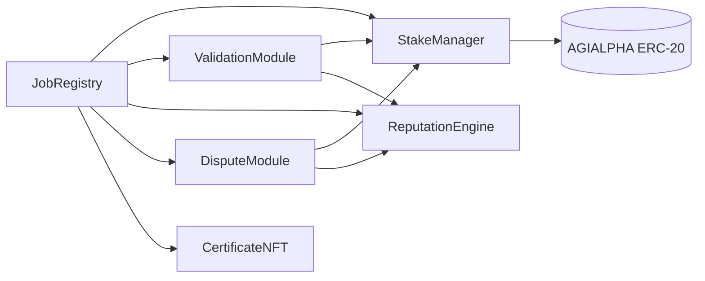

> **Archived**: superseded by [architecture-v2.md](../architecture-v2.md).

# Modular AGIJobs v2 Architecture

AGIJobs v2 replaces the monolithic manager with immutable, single‑purpose modules. Each contract is deployed once, owns its
state, and exposes a minimal interface. The owner (ideally a multisig) may update parameters or swap module addresses without
redeploying the entire suite, delivering governance composability while keeping on‑chain logic simple enough for Etherscan
interactions.

## Module Graph



## Module Responsibilities & Owner Controls

| Module               | Core responsibility                                                                          | Owner abilities                                                                         |
| -------------------- | -------------------------------------------------------------------------------------------- | --------------------------------------------------------------------------------------- |
| **JobRegistry**      | canonical registry for job metadata and state transitions; routes calls to companion modules | swap module addresses with `setModules`, pause job creation, and adjust global settings |
| **StakeManager**     | holds escrowed rewards and participant stakes; executes payouts and slashing                 | tune minimum stakes and slashing percentages                                            |
| **ValidationModule** | selects validators and runs the commit‑reveal finalization                                   | update committee size and timing windows through `setParameters`                        |
| **ReputationEngine** | accrues or subtracts reputation; enforces blacklists                                         | alter reputation weights, thresholds and blacklist entries                              |
| **DisputeModule**    | optional dispute layer for contested jobs                                                    | set dispute fees and moderator/jury addresses                                           |
| **CertificateNFT**   | mints ERC‑721 completion certificates                                                        | update base URI or registry address                                                     |

All modules are deployed as **immutable** contracts. Governance upgrades occur by deploying a new module and pointing `JobRegistry` to the replacement. Every setter is protected by `onlyOwner`, enabling parameter updates without exposing control to external parties.

## Interfaces

Example Solidity interfaces (Solidity ^0.8.20):

```solidity
interface IJobRegistry {
    event JobCreated(
        uint256 indexed jobId,
        address indexed employer,
        address indexed agent,
        uint256 reward,
        uint256 stake,
        uint256 fee
    );
    function createJob(string calldata details, uint256 reward) external;
    function setModules(
        address validation,
        address stake,
        address reputation,
        address dispute,
        address certificate
    ) external;
}

interface IStakeManager {
    function depositStake(uint256 amount) external;
    function lockReward(address from, uint256 amount) external;
    function payReward(address to, uint256 amount) external;
    function slash(address offender, address beneficiary, uint256 amount) external; // `beneficiary` must not be zero when employer share > 0
}

interface IValidationModule {
    function commit(uint256 jobId, bytes32 hash) external;
    function reveal(uint256 jobId, bool verdict, bytes32 salt) external;
    function finalize(uint256 jobId) external;
    function setParameters(
        uint256 commitWindow,
        uint256 revealWindow,
        uint256 minValidators
    ) external;
}

interface IReputationEngine {
    function addSuccess(address user, uint256 weight) external;
    function addFailure(address user, uint256 weight) external;
    function reputationOf(address user) external view returns (uint256);
    function blacklist(address user, bool status) external;
}

interface IDisputeModule {
    function raiseDispute(uint256 jobId, string calldata reason) external;
    function resolve(uint256 jobId, bool uphold) external;
    function setDisputeFee(uint256 fee) external;
}

interface ICertificateNFT {
    function mintCertificate(address employer, uint256 jobId) external;
}
```

## Solidity Structure Recommendations

- Mark module addresses `immutable` where possible and cache them in local variables during calls.
- Use `uint64` or `uint128` for counters and timestamps to pack storage slots.
- Favor `external` and `calldata` for user‑facing functions; use custom errors instead of revert strings.
- Wrap arithmetic in `unchecked` blocks when bounds are enforced elsewhere to save gas.
- Guard external state‑changing functions with `nonReentrant` in `StakeManager` and `JobRegistry`.
- Emit events for every parameter change to aid off‑chain governance tracking.

## Incentive & Physics Analogy

Stakes create the system's Hamiltonian \(H\), representing potential energy locked in collateral. Commit‑reveal voting injects
entropy \(S\) by broadening the distribution of possible validator states. Owner‑tuned parameters act as temperature \(T\), so
participants evolve toward the configuration that minimises the Gibbs free energy \(G = H - T S\). The Nash equilibrium aligns
with this ground state: truthful behaviour minimises energy, while cheating raises expected stake loss, increasing \(H\) and
rendering deviation economically unattractive.

## Token Configuration

The `StakeManager` stores the ERC‑20 used for rewards, staking and dispute fees. By default it references
[`$AGIALPHA`](https://etherscan.io/address/0xA61a3B3a130a9c20768EEBF97E21515A6046a1fA) (18 decimals). Token rotation via
The $AGIALPHA token address is fixed at deployment. All amounts must be provided in base units
(1 token = 1e18 units).

## Explorer‑Friendly Design

All public methods use simple data types so employers, agents and validators can interact through Etherscan's **Write** tab.
Deployment and configuration steps for $AGIALPHA appear in [docs/deployment-v2-agialpha.md](deployment-v2-agialpha.md).

## Governance & Composability

- Every module inherits `Ownable`; only the contract owner or its designated multisig can adjust parameters.
- `JobRegistry.setModules` lets the owner swap in new `ValidationModule`, `StakeManager`, `ReputationEngine`, `DisputeModule`,
  or `CertificateNFT` addresses without migrating state.
- Each setter emits a dedicated event (`ModuleUpdated`, `ParameterUpdated`, etc.), giving off‑chain governance a verifiable
  audit trail.

## Game‑Theoretic Incentives

- Agent and validator stakes create an energy cost for deviation; expected slashing exceeds any short‑term gain.
- The commit–reveal scheme, combined with random validator selection, raises the entropy term so collusion is statistically
  disfavoured.
- `ReputationEngine` reinforces cooperation by reducing future earnings for misbehaving addresses and blacklisting chronic
  offenders.
- Appeals require a token fee via `DisputeModule`, ensuring that only disputes with positive expected value are raised.
- The equilibrium strategy profile is truthful participation: any unilateral deviation results in lower expected utility, meeting
  Nash equilibrium conditions and keeping the protocol's free energy at a minimum.
