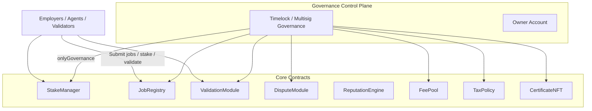
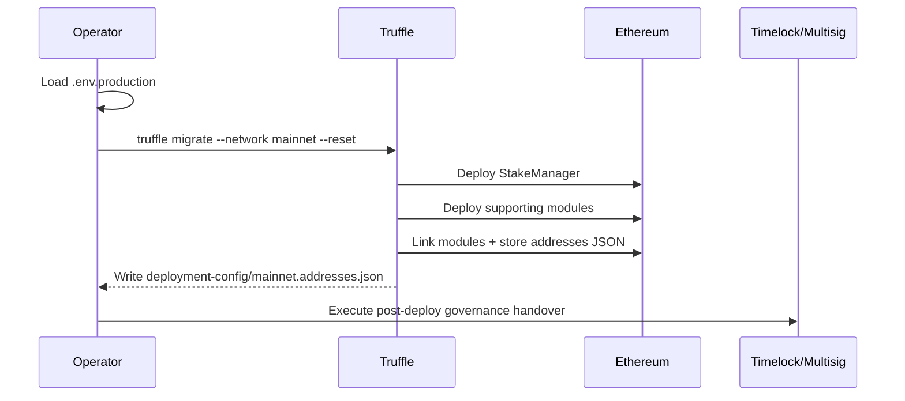

# AGIJobs v2 Mainnet Deployment Playbook

> **Audience:** Non-technical operators who must launch the AGIJobs v2 platform safely on Ethereum mainnet using Truffle.
>
> **Goal:** Provide a zero-assumption, production-grade runbook that covers preparation, execution, validation, and ongoing operations with sufficient redundancy and governance control.

---

## 1. Mission Overview



**Key principle:** Every privileged operation routes through the governance account (timelock or multisig), guaranteeing that the contract owner can reconfigure all parameters after deployment.

---

## 2. Critical Path Checklist

| Phase | Objectives | Verification Tools |
| --- | --- | --- |
| **Preparation** | Harden operator workstation, load environment variables, review `deployment-config/mainnet.json`. | `npm ci`, `npm run lint`, `npm run verify:agialpha`, `npm run wire:verify`. |
| **Dry Run (Optional but recommended)** | Execute migrations against a fork or Sepolia using the same config. | `truffle migrate --network sepolia`, `npm test`, Foundry/Hardhat tests. |
| **Mainnet Launch** | Deploy via Truffle, confirm addresses, transfer governance. | `truffle migrate --network mainnet`, JSON artifact review, Etherscan verification. |
| **Post-Launch** | Store artifacts, run smoke tests, hand over governance. | `npx ts-node scripts/transfer-ownership.ts`, `npx hardhat call`, Slither report. |

---

## 3. Prerequisites

### 3.1 Workstation Hardening

1. Use a clean machine (dedicated hardware wallet laptop or hardened VM).
2. Install the LTS toolchain:
   - Node.js 20.x (`nvm install 20 && nvm use 20`).
   - Python 3.11+ (for Slither and auxiliary scripts).
   - Git ≥ 2.40.
3. Install global CLI helpers:
   ```bash
   npm install -g truffle@5.11.5 pnpm@9.0.0
   pipx install slither-analyzer==0.10.4
   ```
4. Confirm the repo state is clean:
   ```bash
   git clone https://github.com/MontrealAI/AGIJobsv2.git
   cd AGIJobsv2
   npm ci --no-audit --no-fund
   ```

### 3.2 Secrets & Environment Variables

Create a dedicated `.env.production` file (never commit it):

```bash
cp .env.example .env.production
```

Populate the following variables with hardware wallet or custody-provided values:

| Variable | Purpose |
| --- | --- |
| `PK` **or** `MNEMONIC` | Private key or mnemonic of the hot deployment wallet (prefer a time-limited hardware signer via [@truffle/hdwallet-provider](https://www.npmjs.com/package/@truffle/hdwallet-provider)). |
| `INFURA_KEY` | Mainnet RPC access token. Consider a fallback Alchemy or custom node URL. |
| `ETHERSCAN_API_KEY` | Enables automatic source verification. |
| `GAS_PRICE_GWEI` | Optional override to tune pricing during volatile network conditions. |

> ⚠️ **Safety:** Fund the deployment wallet with enough ETH for contract creation *and* contingency transactions (recommend ≥ 1.5× projected gas cost).

Load the environment before any command:

```bash
export $(grep -v '^#' .env.production | xargs)
```

---

## 4. Configuration Management

### 4.1 Edit `deployment-config/mainnet.json`

Use the JSON file to define every tunable parameter. Replace the placeholder zero addresses with production addresses.

```jsonc
{
  "governance": {
    "initial": "0xYourHotWallet",      // Deploy-from address
    "final": "0xYourTimelockOrMultisig" // Long-term controller
  },
  "stakeManager": {
    "minStakeTokens": "10",
    "employerSlashPct": 50,
    "treasurySlashPct": 50,
    "treasury": "0xTreasuryWallet"
  },
  // ... remaining modules ...
}
```

**Guidance:**

- Percentages are integers between 0 and 100.
- Token amounts use 18 decimal fixed-point strings (e.g., `"1.5"`).
- ENS and Merkle roots must be production values for identity gating.
- Leave `taxPolicy.deploy` set to `true` if you require the on-chain acknowledgement module.

### 4.2 Multi-environment Safety

Maintain separate config files (`deployment-config/sepolia.json`, etc.) so dry runs cannot accidentally use mainnet addresses. The migration script automatically falls back to `mainnet.json` if a network-specific file is absent.

### 4.3 Double-entry Verification

1. Pair-program the configuration review with a second operator.
2. Run an automated sanity check:
   ```bash
   npm run wire:verify
   npm run verify:ens
   ```
3. Confirm no diffs are introduced by the compile step:
   ```bash
   npm run compile
   git diff --exit-code contracts/Constants.sol
   ```

---

## 5. Deployment Execution (Truffle)



### 5.1 Dry Run (Highly Recommended)

```bash
truffle migrate --network sepolia --reset
truffle test --network sepolia
```

Archive the resulting `deployment-config/sepolia.addresses.json` for auditing.

### 5.2 Production Run

```bash
# Use --reset only if you need to redeploy from scratch.
truffle migrate --network mainnet
```

Monitor the console output for each transaction hash. Cross-check on Etherscan before advancing to the next phase.

**Artifacts:**

- `deployment-config/mainnet.addresses.json` – canonical record of deployed contract addresses.
- `build/contracts/*.json` – ABI + bytecode for off-chain services.

### 5.3 Source Verification

Once contracts are mined:

```bash
truffle run verify StakeManager@0x... JobRegistry@0x... --network mainnet
```

For bulk verification, use the addresses JSON to script the command. Verification ensures transparency and is a prerequisite for many institutional custodians.

---

## 6. Post-Deployment Governance

### 6.1 Transfer Governance to the Final Controller

1. Create `docs/deployment-addresses.json` by copying the generated mainnet addresses file:
   ```bash
   cp deployment-config/mainnet.addresses.json docs/deployment-addresses.json
   ```
2. Run the ownership transfer helper:
   ```bash
   npx ts-node --compiler-options '{"module":"commonjs"}' \
     scripts/transfer-ownership.ts --new-owner 0xYourTimelock
   ```
3. Review the on-chain logs to confirm each contract now reports the new owner via `owner()` or `governance()` calls.

### 6.2 Exercising Owner Controls

All configurable parameters expose `onlyGovernance` setters. Representative examples:

| Contract | Function | Purpose |
| --- | --- | --- |
| `StakeManager` | `setMinStake`, `setSlashingPercentages`, `setUnbondingPeriod` | Adjust staking economics. |
| `JobRegistry` | `setFeePct`, `setStakeManager`, `setValidationModule` | Align job fees and module wiring. |
| `ValidationModule` | `setCommitRevealWindow`, `setValidatorPool` | Tune validator selection. |
| `FeePool` | `setTreasury`, `setBurnPct` | Update treasury routing and burn ratio. |
| `TaxPolicy` | `setURI`, `setAcknowledgement` | Publish new tax policy messaging. |

> **Execution path:** Submit governance transactions via your timelock/multisig UI (e.g., Safe, Tally). Each call must target the contract directly with the encoded function selector.

### 6.3 Emergency Procedures

- `SystemPause` exposes `pause()`/`unpause()` to halt operations across dependent modules.
- `GovernanceReward` and `RewardEngineMB` can be reconfigured to modify reward logic if economic parameters drift.
- Use `scripts/transfer-ownership.ts` with a new address to enact emergency governance rotation.

---

## 7. Validation & Monitoring

1. **Automated QA:**
   ```bash
   npm run lint
   npm test
   npm run coverage:full
   npm run echidna
   npm run slither
   npm run gas:check
   ```
2. **Runtime Smoke Tests:**
   - Call read-only functions (e.g., `StakeManager.getStakeInfo`) via Hardhat console.
   - Submit a small job with dummy addresses on a fork to validate end-to-end.
3. **Observability:**
   - Track critical events (`JobCreated`, `StakeDeposited`, `DisputeOpened`) via an indexer (The Graph, Substreams, or in-house tooling).
   - Enable alerting on governance and pause events.

---

## 8. Institutional Operations

- **Access Control:** Restrict the deployment workstation, disable auto-updates, and ensure the hardware wallet session times out quickly.
- **Runbooks:** Store this playbook, config files, and all console transcripts in an immutable document repository.
- **Separation of Duties:** Require dual control for any governance parameter change (one operator prepares calldata, another approves).
- **Periodic Reviews:** Schedule quarterly tests of pause/unpause, ownership rotation, and fee updates to ensure processes remain sharp.

---

## 9. Appendix

### 9.1 Reference Commands

```bash
# Compile + lint
npm run compile
npm run lint

# Hardhat console for ad-hoc queries
npx hardhat console --network mainnet

# Example: check StakeManager parameters
await (await ethers.getContractAt('StakeManager', '0x...')).minStake();
```

### 9.2 Glossary

- **Governance Account:** Timelock or multisig authorized to execute `onlyGovernance` transactions.
- **Hot Wallet:** Temporary signer used only for deployment before handoff.
- **Module:** Deployable contract that plugs into the core AGIJobs workflow (validation, disputes, rewards, etc.).

---

> **Final Sanity Pause:** After completing every step, pause, review each transaction hash, and maintain an auditable log. A second operator must countersign the completion of each checklist item.

