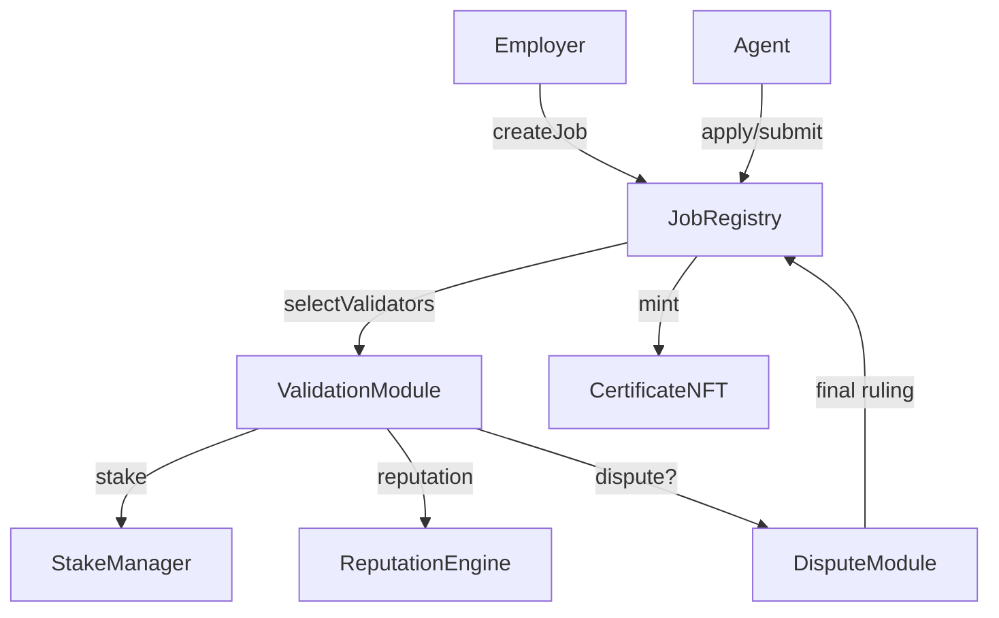
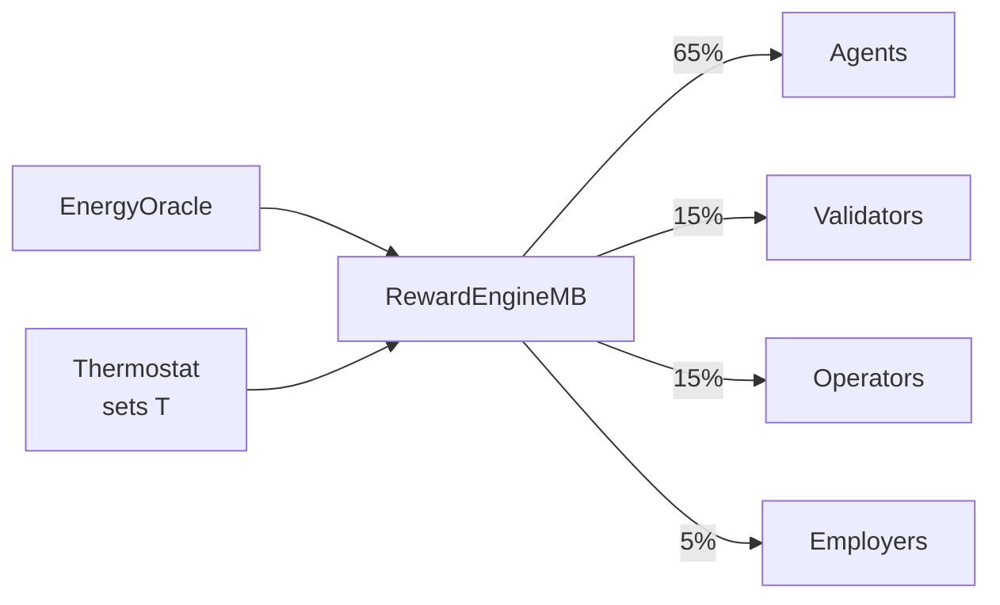

# AGIJobs Overview

## Architecture



### Module Summaries

| Module           | Responsibility                                             |
| ---------------- | ---------------------------------------------------------- |
| JobRegistry      | Posts jobs, escrows payouts, tracks lifecycle.             |
| ValidationModule | Selects validators and runs commit‑reveal voting.          |
| DisputeModule    | Coordinates appeals and final rulings.                     |
| StakeManager     | Custodies collateral, releases rewards, executes slashing. |
| ReputationEngine | Updates reputation, enforces blacklists.                   |
| CertificateNFT   | Mints ERC‑721 certificates for completed jobs.             |

## Universal Incentive System

The v2 contracts share a unified incentive model built around the 18‑decimal **$AGIALPHA** token. Core modules—`StakeManager`, `PlatformRegistry`, `JobRouter`, `FeePool`, and `PlatformIncentives`—coordinate staking, job routing, and fee distribution:

- **Staking** – Agents, validators, and platform operators stake through `StakeManager` under their respective roles. Stakes secure honest behaviour and unlock job participation.
- **Routing** – `JobRegistry` locks each job's reward and protocol fee, then routes the fee portion to `FeePool` on finalisation.
- **Revenue share** – `FeePool` streams accumulated fees to platform operators pro‑rata to their staked amount.
- **Zero‑stake main deployer** – The primary deployment address holds no stake and receives no rewards; all revenue accrues to platform stakers.
- The deployer may still register its platform but gains no routing priority or revenue share without staking.
  - **Worked example**
    1. The owner skips `depositStake` (amount = `0`) and calls `PlatformRegistry.register()`.
    2. `PlatformRegistry.getScore(owner)` returns `0`, so the platform has no routing weight.
    3. Calling `FeePool.claimRewards()` emits `RewardsClaimed(owner, 0)`, confirming no payout.

### Roles and Incentives

| Role              |              Stake | Incentives                                                         |
| ----------------- | -----------------: | ------------------------------------------------------------------ |
| Platform operator | `minPlatformStake` | Routing priority and proportional share of `FeePool` distributions |
| Agent             |    job‑level stake | Eligibility to complete work and earn rewards                      |
| Validator         |  owner‑set minimum | Commit–reveal voting rights and validation rewards                 |
| Main deployer     |                  0 | Demonstration only: zero routing score or fee share                |
| Owner             |                  0 | Adjusts parameters but must stake to earn fees                     |

### Scoring and Fee Distribution

Routing score = `(stake * stakeWeight + reputation * reputationWeight) / 1e18` from `PlatformRegistry.getScore`.

Example: if an operator stakes `2,000` tokens and has reputation `500` with weights `0.7e18` and `0.3e18`, then `score = (2,000 × 0.7 + 500 × 0.3) = 1,550`.

Fee share = `fee * operatorStake / totalStake` in `FeePool`.

Example: a job sending a `100` token fee to `FeePool` with `operatorStake = 2,000` and `totalStake = 10,000` yields `100 × 2,000 / 10,000 = 20` tokens for that operator.

Each contract exposes `isTaxExempt(addr)` and rejects direct ETH to keep value transfers on‑chain and pseudonymous. A platform may register with `0` stake; both routing score and fee share evaluate to zero, so the deployer can demonstrate expected behaviour without revealing taxable revenue.

## Etherscan Interactions

1. Open the relevant contract address on Etherscan.
2. In **Write Contract**, connect your wallet.
3. Call the desired function and submit the transaction.
4. Verify emitted events and new state in **Read Contract** or on a second explorer.

For a step-by-step deployment walkthrough with owner-only setters, see [deployment-v2-agialpha.md](deployment-v2-agialpha.md).
For a production deployment checklist, consult [deployment-guide-production.md](deployment-guide-production.md).

### Governance Timelock

All privileged parameter changes are executed through an
OpenZeppelin `TimelockController` configured with a **7‑day delay**.
Transactions must be queued and can only be executed once the delay has
elapsed, giving the community time to review upcoming changes.

### Owner Controls and Defaults

| Module           | Owner-only setters (default)                                                                                                                                                                  | Purpose                                                                                           |
| ---------------- | --------------------------------------------------------------------------------------------------------------------------------------------------------------------------------------------- | ------------------------------------------------------------------------------------------------- |
| JobRegistry      | `setModules` (none set), `setJobParameters` (`reward=0`, `stake=0`), `setFeePool` (0 address), `setFeePct` (`0`), `setTaxPolicy` (0 address)                                                  | Wire modules, set template stake/reward, and configure fees/tax policy.                           |
| ValidationModule | `setValidatorPool` (empty), `setReputationEngine` (0 address), `setCommitRevealWindows` (`0`, `0`), `setValidatorBounds` (`0`, `0`)                                                           | Choose validators and tune commit/reveal timing and committee sizes.                              |
| DisputeModule    | `addModerator(address, weight)` / `removeModerator(address)` (owner), majority-signed `resolve(jobId, verdict, signatures)`, `setDisputeFee` (`0`), `setJobRegistry` (constructor address)    | Configure dispute bond and weighted arbiters; disputes finalize via moderator vote or owner call. |
| StakeManager     | `setMinStake` (`0`), `setSlashingPercentages` (`0`, `100`), `setTreasury` (constructor treasury), `setJobRegistry` (0 address), `setDisputeModule` (0 address), `setMaxStakePerAddress` (`0`) | Adjust staking token, minimums, slashing rules, and authorised modules.                           |
| ReputationEngine | `setCaller` (`false`), `setStakeManager` (constructor address), `setScoringWeights` (`1e18`, `1e18`), `setThreshold` (`0`), `blacklist` (`false`)                                             | Manage scoring weights, authorised callers, and blacklist threshold.                              |
| CertificateNFT   | `setJobRegistry` (0 address)                                                                                                                                                                  | Authorise minting registry; URIs emitted in events with hashes on-chain.                          |

StakeManager defaults to routing all seized stake to the treasury (`employerSlashPct = 0`, `treasurySlashPct = 100`). This avoids giving employers a windfall for slashing and funds shared infrastructure. Governance can later adjust the split with `setSlashingPercentages` to refund employers if desired.

Example of swapping validation logic:

```solidity
NoValidationModule fast = new NoValidationModule(registry);
registry.setValidationModule(address(fast));
```

## Thermodynamic Incentives

`RewardEngineMB` coordinates payouts using thermodynamic principles. The `EnergyOracle` supplies per-task energy and entropy, while the `Thermostat` sets the effective temperature `T`. Gibbs free energy `G = H − T·S` guides the reward budget: higher `T` emphasises entropy and spreads rewards across many participants, whereas lower `T` concentrates them on the most efficient actors.

**Role shares per epoch**

- Agents – 65 %
- Validators – 15 %
- Operators – 15 %
- Employers – 5 %



### Best Practices

- **Agents** – Reduce energy per task through optimisation and caching to earn a larger share of the budget.
- **Validators** – Keep validation scripts lightweight and deterministic to minimise entropy in votes.
- **Employers** – Define tasks clearly so agents avoid wasted effort, preserving more free energy for rewards.
- **Operators** – Run energy‑efficient infrastructure and expose telemetry so the oracle can track consumption accurately.

### Governance Tuning

Metrics from the reward/burn dashboard reveal how much of each epoch's budget is burned or redistributed. If the burn ratio drifts
from unity or redistribution becomes skewed, governance can submit timelock proposals to steer incentives. Proposals may call
`RewardEngineMB.setMu()` to change the emission coefficient `μ` or `Thermostat.setSystemTemperature()` to adjust the global
temperature. After the delay elapses and the proposal is executed, the new parameters take effect.

## Deployment Addresses

| Contract         | Network          | Address                                                                                                               |
| ---------------- | ---------------- | --------------------------------------------------------------------------------------------------------------------- |
| AGIJobManager v0 | Ethereum mainnet | [0x0178b6bad606aaf908f72135b8ec32fc1d5ba477](https://etherscan.io/address/0x0178b6bad606aaf908f72135b8ec32fc1d5ba477) |
| $AGIALPHA Token  | Ethereum mainnet | [0xA61a3B3a130a9c20768EEBF97E21515A6046a1fA](https://etherscan.io/address/0xA61a3B3a130a9c20768EEBF97E21515A6046a1fA) |

## Quick Start

1. Clone the repository and install dependencies:
   ```bash
   git clone https://github.com/MontrealAI/AGIJobsv2.git
   cd AGIJobsv2
   npm install
   ```
2. Compile contracts and run the tests:
   ```bash
   npm run compile
   npm test
   ```
3. Interact with deployed contracts through a wallet or block explorer.
