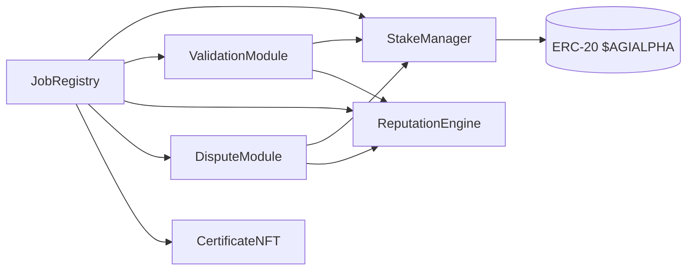

# AGIJobs v2 Module & Interface Reference

This document condenses the production-scale architecture into standalone modules, each with a minimal interface and owner-only governance hooks. It is a companion to `docs/architecture-v2.md` and `docs/deployment-v2-agialpha.md` and focuses on contract boundaries and Solidity structure tips. All modules now expose `version()` returning **2** so other components can verify compatibility during upgrades. The reputation system is implemented by a single contract, `contracts/ReputationEngine.sol`, which replaces the former module variant.

## Module Graph



## Core Interfaces (Solidity ^0.8.20)

```solidity
interface IJobRegistry {
    event JobCreated(
        uint256 indexed jobId,
        address indexed employer,
        address indexed agent,
        uint256 reward,
        uint256 stake,
        uint256 fee
    );
    event AdditionalAgentUpdated(address indexed agent, bool allowed);
    function createJob(string calldata details, uint256 reward) external;
    function setModules(
        address validation,
        address stake,
        address reputation,
        address dispute,
        address certificate
    ) external;
    function addAdditionalAgent(address agent) external;
    function removeAdditionalAgent(address agent) external;
}

interface IStakeManager {
    function depositStake(uint256 amount) external;
    function lockReward(address from, uint256 amount) external;
    function payReward(address to, uint256 amount) external;
    function slash(address offender, address beneficiary, uint256 amount) external; // `beneficiary` must not be zero when employer share > 0
}

interface IValidationModule {
    event AdditionalValidatorUpdated(address indexed validator, bool allowed);
    function commit(uint256 jobId, bytes32 hash) external;
    function reveal(uint256 jobId, bool verdict, bytes32 salt) external;
    function finalize(uint256 jobId) external;
    function setParameters(uint256 commitWindow, uint256 revealWindow, uint256 minValidators) external;
    function addAdditionalValidator(address validator) external;
    function removeAdditionalValidator(address validator) external;
}

interface IReputationEngine {
    function addSuccess(address user, uint256 weight) external;
    function addFailure(address user, uint256 weight) external;
    function reputationOf(address user) external view returns (uint256);
    function blacklist(address user, bool status) external;
}

interface IDisputeModule {
    function raiseDispute(
        uint256 jobId,
        address claimant,
        string calldata evidence
    ) external;
    function resolve(
        uint256 jobId,
        bool employerWins,
        bytes[] calldata signatures
    ) external;
    function addModerator(address moderator, uint256 weight) external;
    function removeModerator(address moderator) external;
    function setJobRegistry(IJobRegistry newRegistry) external;
    function setStakeManager(IStakeManager newManager) external;
}

interface ICertificateNFT {
    function mintCertificate(address employer, uint256 jobId) external;
}
```

## Solidity Structure Recommendations

- Mark module addresses `immutable` and cache them in local variables.
- Pack small variables (`uint64`, `uint96`) to minimise storage slots.
- Prefer `external` + `calldata` for user calls; use custom errors over revert strings.
- Apply `unchecked` arithmetic where bounds are enforced to save gas.
- Guard token transfers with `nonReentrant` in `StakeManager` and `JobRegistry`.
- Emit events for every configuration change so off-chain services can track state.

## Incentive & Physics Analogy

Stakes form potential energy \(H\); commit–reveal voting injects entropy \(S\). Owner‑tuned parameters act as temperature \(T\). The network evolves toward minimum Gibbs free energy \(G = H - TS\), making honest behaviour the dominant, low‑energy strategy. Slashing raises \(H\) for cheaters, while random validator selection increases \(S\), keeping collusion energetically unfavourable.

## Owner Control & Token Flexibility

All setters are `onlyOwner`. v2 assumes the 18‑decimal [$AGIALPHA](https://etherscan.io/address/0xA61a3B3a130a9c20768EEBF97E21515A6046a1fA) token for all modules with the address fixed at deployment. All amounts are supplied in base units (1 token = 1e18). For example `0.1` token is `100_000000000000000` and `12` tokens are `12_000000000000000000`.

## Governance Composability

- Modules are immutable once deployed; to upgrade a component the owner deploys a new module and calls `JobRegistry.setModules` with the replacement address.
- Parameter tweaks emit dedicated events (`ParameterUpdated`, `ModuleUpdated`) so off-chain tooling and multisigs can monitor governance moves.
- Minimal, single-purpose setters keep Etherscan interactions straightforward for non-technical owners while ensuring clear on-chain audit trails.
